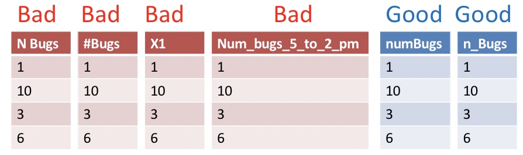
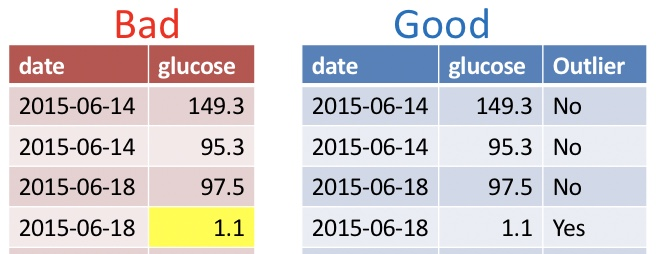
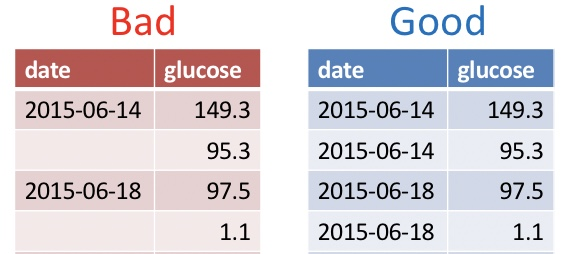
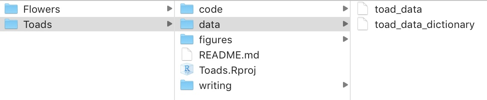
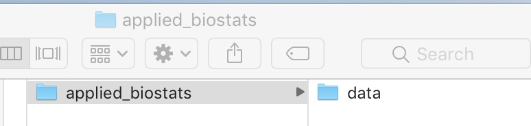

# Collecting and storing data  {#data1}


```{r, echo = FALSE, message=FALSE}
library(knitr)
library(tidyverse)
library(blogdown)
library(tweetrmd)
library(tufte)
library(emo)
options(crayon.enabled = FALSE)   
```

<span style="color: Blue;font-size:22px;">   Motivating scenario:  </span>  <span style="color: Black;font-size:18px;"> We start at the beginning of a study -- how do we set up a good way to keep track of data that will allow us to focus on understanding and analyzing our data, not reorganizing and rearranging it? </span> 

```{r collecting, out.extra= 'allowfullscreen', out.width="40%", out.extra='style="float:right; padding:10px"', echo=FALSE}
include_url("https://www.youtube.com/embed/TPWPzrzY_1M",height = "200")
```


**Learning goals: By the end of this chapter you should be able to**  

- Describe best principles for collecting, storing, and maintaining data.    
- Explain why these are good ideas.     
- Differentiate between *tidy* and *messy*  data.  
- Load data into R using a project


```{block2, type='rmdwarning'}
There is no external reading for this chapter, and no complementary chapter in our textbook. This chapter draws from three highly recommended articles:     
  (1) *[Data Organization in Spreadsheets](https://www.tandfonline.com/doi/citedby/10.1080/00031305.2017.1375989?scroll=top&needAccess=true)* [@broman2018].     
(2) *[Tidy Data](https://vita.had.co.nz/papers/tidy-data.pdf)* [@TidyData].        
(3)  *[Ten Simple Rules for Reproducible Computational Research](https://journals.plos.org/ploscompbiol/article?id=10.1371/journal.pcbi.1003285)* [@sandve2013].       
```

## Protecting and nurturing your data 

We care about the data, the data are our guide through this world. It is therefore very important to ensure the integrity of our data. [Kate Laskowski](https://laskowskilab.faculty.ucdavis.edu/people/kate-laskowski/) learned this all too well, [when her collaborator messed with her data set](https://laskowskilab.faculty.ucdavis.edu/2020/01/29/retractions/). In the required video below, she outlines the best practices to ensure the integrity of your data, both against unscrupulous collaborators, or, more likely, minor mistakes introduced in the process of data collection and analysis.

```{r, echo = FALSE, fig.cap = '[Kate Laskowski](https://laskowskilab.faculty.ucdavis.edu/people/kate-laskowski/)  on data integrity (6 min and 06 seconds).', echo=FALSE, out.extra= 'allowfullscreen'}
include_url("https://www.youtube.com/embed/G9LDtFMsUmY")
```


## Data in spreadsheets   

Data are most often stored in spreadsheets, or sometimes in databases. An important rule for reproducible data analysis is that data should be entered in a spreadsheet and then untouched. Instead of modifying data in a spreadsheet, we should develop scripts to process and filter the data. This ensures that we can honestly share exactly what we did and reproduce our analysis from raw data to final product.


```{r,  out.width="40%", out.extra='style="float:right; padding:10px"', echo=FALSE}
include_url("https://www.youtube.com/embed/0f8PTAQGdGY",height = "200")
```


### Entering data into spreadsheets   
A critical part of conducting a study is knowing what you are measuring, how you are measuring it, how you're entering it and what else you might want to know.  

If you are collecting your own data, or you are in on the ground floor of the initial data collection phase of a study, you should spend a few hours reflecting on what your spreadsheet should look like, and then take a handful of data and then revisit and restructure as necessary. In doing so, take the guidance in this section, largely lifted from [[@broman2018]](https://www.tandfonline.com/doi/citedby/10.1080/00031305.2017.1375989?scroll=top&needAccess=true), into account. You'll thank me later!!!


```{r  echo = FALSE}
include_tweet("https://twitter.com/kwbroman/status/1326678636649394176")
```


#### Be consistent and deliberate    
You should refer to a thing in the same thoughtful way throughout a column. Take, for example, gender as a nominal variable.

<span style="color: red;">A bad organization would be:</span> male, female, Male, M, Non-binary, Female.    
<span style="color: blue;">A good organization would be:</span> male, female, male, male, non-binary, female.  
<span style="color: blue;">A just as good organization would be:</span> Male, Female, Male, Male, Non-binary, Female.   

`r ji(keyword = "thinking")` Why? `r ji(keyword = "thinking")` Because if we are doing an analysis of say gender discrimination we don't want males and Males to represent different groups.

```{block2, type='rmdtip'}
The advice above  also holds for dates and missing values. 

- The most common convention for dates is:  YYYY-MM-DD. 

- The most common convention is to leave cells empty if you don't have it yet, and fill them with `NA` if you will never get that data point.   
```


#### Use good names for things 

```{r fig.cap='', echo=FALSE, out.extra='style="float:right; padding:10px"'}

```

Names should be concise and descriptive. They need not tell the entire story. For example, units are better kept in a data dictionary than column name.  


`r ji(keyword = "thinking")` Why? `r ji(keyword = "thinking")` You don't want to keep typing long awkward things in `R` but you do want variable names to convey meaning you can instantly recognize. 

#### Make a data dictionary    
What is a **data dictionary**, you ask? All the TMI that you would otherwise put in your overly complex column names. So, each row should correspond to a variable in the main data file, and each column should be additional info. For example, columns could be `name`, `description`, `type`, `unit`,`range_or_values`, etc...  


`r ji(keyword = "thinking")` Why? `r ji(keyword = "thinking")` You want to have this information easily accessible without gumming up your data sheet. 


#### Do Not  Use Font Color or Highlighting  as  Data 


```{r fig.cap='', echo=FALSE, out.extra='style="float:right; padding:10px"'}

```

You may be tempted to encode information with bolded text, highlighting, or text color. Don't do this! Be sure that all information is in a readable column. 


`r ji(keyword = "thinking")` Why? `r ji(keyword = "thinking")` These  extra markings will either be lost or add an extra degree of difficulty to your analysis. Reserve such markings for the presentation of data. 

#### No  values should  be  implied. 

```{r fig.cap='', echo=FALSE, out.extra='style="float:right; padding:10px"'}

```

Never leave  an entry blank as "shorthand for same as above". Similarly, never denote the first replicate (or treatment, or whatever) by its order in a spreadsheet, but rather make this explicit with a value in a column.  

 
`r ji(keyword = "thinking")` Why? `r ji(keyword = "thinking")` Data order could get jumbled and besides it would take quite a bit of effort to go from implied order to a statistical analysis. 


#### Backup your data, do not touch the original data file and do not perform calculations on it. 

Save your data on both your computer and a locked, un-editable location on the cloud (e.g. google docs, dropbox, etc.)

`r ji(keyword = "thinking")` Why? `r ji(keyword = "thinking")` Your data set is valuable. You don't want anything to happen to it. It also could allow you to ensure that your collaborators (and/or [former house-mates](https://laskowskilab.faculty.ucdavis.edu/2020/01/29/retractions/)) did not manipulate the data.


#### Data should be tidy  (aka rectangular)


```{r fig.cap='', echo=FALSE, out.width='70%', out.extra='style="float:right; padding:10px"'}
knitr::include_graphics('https://github.com/allisonhorst/stats-illustrations/raw/master/rstats-artwork/tidydata_1.jpg')
#knitr::include_graphics('images/tidy.jpeg')
```

This means    

- Each variable must have its own column.   
- Each observation must have its own row.   
- Each value must have its own cell.  

```{r fig.cap='', echo=FALSE, out.width='80%'}
knitr::include_graphics('https://github.com/allisonhorst/stats-illustrations/raw/master/rstats-artwork/tidydata_2.jpg')
```


`r ji(keyword = "thinking")` Why? `r ji(keyword = "thinking")` This data structure usually makes statistical analysis and data visualization much easier. 


```{r,  out.width="40%", out.extra='style="float:right; padding:10px"', echo=FALSE}
include_url("https://www.youtube.com/embed/pYNEpBTmfoI",height = "200")
```


### Dealing with (other people's)  data in spreadsheets  

We are often given data collected by someone else (collaborators, open data sets etc). If we're lucky they did a great job and we're ready to go. More often, they did ok and we have a painful hour to a painful week ahead of us as we clean up their data. Rarely, their data collection practices are so poor that their data are not useful. 

In this course we will cover some basic *data wrangling* tools to deal with ugly datasets, but that is not a course focus or course goal. So, our attention to this issue will be minimal. If you want more help here, I suggest part II of [R for Data Science](https://r4ds.had.co.nz/) [@grolemund2018].


### Saving data    

It's best practice to save data as a lightweight, flat file like a `.csv`. Excel allows you to save datasets as a csv!   But if you really want to use `.xls` or `.xlsx` format you can. Just be aware that some features, especially those I wanted you to avoid, above, may not work well once imported into `R`. 

### Organizing folders {#orgfolder}

Make life easy on yourself by giving each project its own folder, with sub-folders for data, figures, code, and writing. This makes analyses easy to share and reproduce.

```{r fig.cap='Example folder structure', echo=FALSE}

```


I **highly recommend treating this course as a project**, so make a folder on your computer called `applied_biostats` and a folder in there called data. If you do this, your life will be better. You might even want to do one better and tret each class session as a project. 


```{r, echo=FALSE, out.width="50%"}

```


## Loading A Spreadsheet into `R`    

Getting data into R is often the first challenge we run into in our first R analysis. The video (Fig: \@ref(fig:intoR)) and text below should help you get started. 


 
```{r intoR, fig.cap='Getting data into R (5 in and 10 seconds).', echo=FALSE, out.extra = 'allowfullscreen', out.width="40%", out.extra='style="float:right; padding:10px"'}
include_url("https://www.youtube.com/embed/d7gYc1o2M3c?start=94" , height = "200")
```


Ideally, your data are stored as a `.csv`, and if so you can read data in with the [`read_csv()`](https://readr.tidyverse.org/reference/read_delim.html) function. `R` can deal with other formats as well. Notably, using the function [`readxl::read_excel()`](https://readxl.tidyverse.org/reference/read_excel.html) allows us to read data from *Excel*, and can take the Sheet of interest as an argument in this function. 


Here's an example of how to read data into `R`.  
To start we open `Toads.Rproj` by either 

- Opening RStudio by opening `Toads.Rproj` or
- Clicking `File` and navigating to `Open project` once RStudio is open.   

```{r, eval=FALSE}
library(tidyverse)
toad_data <- read_csv(file = "data/toad_data.csv")
```

Opening `Toads.Rproj` tells RStudio that this is our home base.  The bit that says `data/` points `R` to the correct folder in our base, while `toad_data.csv` refers to the file we're reading into `R`.   The assignment operator `<-` assignins this to `toad_data`.  Using tab-completion in RStudio makes finding our way to the file less terrible. <span style="color: lightgrey;"> But you can also point and click your way to data (see below). If you do, be sure to copy and paste the code you see in the code preview into the script so you can recreate your analysis.</span>.
  


```{r fig.cap='', echo=FALSE}
#knitr::include_graphics('images/loadingdata.jpeg')
```


```{block2, type='rmdtip'}
As above, best practices for loading data make use of R [projects](https://r4ds.had.co.nz/workflow-projects.html), so feel free to learn more. But for now, we're focused on *good enough* practices. 
```


## Tidying  messy data   


```{r fig.cap='Tidy tools require tidy data', echo=FALSE, out.width='80%'}
knitr::include_graphics('https://github.com/allisonhorst/stats-illustrations/raw/master/rstats-artwork/tidydata_3.jpg')
#include_tweet("https://twitter.com/LucyStats/status/1148634381352726528",hide_thread=TRUE)
```


Above, we said it is best to keep data in a tidy format, and in Section \@ref(tidyverse) we noted that Tidyverse tools have a unified grammar and data structure.  From the name, tidyverse, you could probably guess that tidyverse tools require tidy data -- data in which every variable is a column and each observation is a row. What if the data you loaded  are untidy? The [`pivot_longer`](https://tidyr.tidyverse.org/reference/pivot_longer.html) function in the [`tidyr`](https://tidyr.tidyverse.org/) package (which loads automatically with tidyverse) can help! Take this example dataset, about `grades` in last year's course. 

```{r, echo=FALSE}
grades <- tibble(
  last_name  = c("Horseman", "Carolyn"), 
  first_name = c("BoJack", "Princess"),
  exam_1     = c(70, 97)/2, 
  exam_2     = c(73, 95)/2
)

grades
```

This is not tidy. If it were tidy each observation would be a score on an exam. So we need to move exam to another column. We can do this!!!

```{r}
tidy_grades <-pivot_longer(data = grades, # Our data set
             cols = c(exam_1, exam_2),    # The data we want to combine
             names_to = "exam",           # The name of the new column in which we put old names.
             values_to = "score"          # The name of the new column in which we put the values.  
             )

tidy_grades
```

This function name, [`pivot_longer`](https://tidyr.tidyverse.org/reference/pivot_longer.html), makes sense because another name for tidy data is *long format*. You can use the [`pivot_wider`](https://tidyr.tidyverse.org/reference/pivot_wider.html) function to get data into a *wide format*.

Learn more about tidying messy data in Fig. \@ref(fig:tidying):

```{r tidying, fig.cap='Tidying data (first 5 min and 40 seconds are relevant).',  echo=FALSE, out.extra= 'allowfullscreen'}
include_url("https://www.youtube.com/embed/qivE6exNsZI?end=340")
```


## Assignment {-}

The assignment is to be turned in on [canvas](https://canvas.umn.edu/courses/225135/quizzes/407366), it has questions revolving around.

1.  Identify a dataset on your computer (ideally one that is important to you if you have one), or one you've come across in another class, or online etc... Does it follow best practices in spreadsheet setup? Explain why or why not.  

2. Make up a small dataset, either from simple observations in your world or from your imagination following best practices in spreadsheet setup.    

3. Quiz questions that are the same as those below. If you try them first here, you'll be sure to enter the right answers on [canvas](https://canvas.umn.edu/courses/284485/quizzes/558868).  

4. Reflecting on Kate Laskowski's video.  


## Quiz {-}

```{r, echo=FALSE}
knitr::include_app('https://brandvain.shinyapps.io/intro2data/', height = '500px')
```


## Functions covered  in *Handlign data in `R`* 

All require the tidyverse package


```{block2, type='rmdcode'}
[`read_csv()`](https://readr.tidyverse.org/reference/read_delim.html):  Reads a dataset saved as a .csv into R.  
[`readxl::read_excel()`](https://readxl.tidyverse.org/reference/read_excel.html): Reads a  dataset saved as a .xlsx into R. You can also specify the sheet with *sheet =*.   
[`pivot_longer()`](https://tidyr.tidyverse.org/reference/pivot_longer.html): Allows use to tidy data.    
[`pivot_wider()`](https://tidyr.tidyverse.org/reference/pivot_wider.html): Allows use to go from tidy to wide data.   

```


### tidyr cheat sheet

There is no need to memorize anything, check out this [handy cheat sheet](https://github.com/rstudio/cheatsheets/raw/main/tidyr.pdf)!

```{r fig.cap='download the [tidyr cheat sheet](https://github.com/rstudio/cheatsheets/raw/main/tidyr.pdf)', echo=FALSE}
knitr::include_graphics('https://raw.githubusercontent.com/rstudio/cheatsheets/main/pngs/tidyr.png')
```


### importing data cheat sheet

There is no need to memorize anything, check out this [handy cheat sheet](https://raw.githubusercontent.com/rstudio/cheatsheets/main/data-import.pdf)!

```{r fig.cap='download the [importing data cheat sheet](https://raw.githubusercontent.com/rstudio/cheatsheets/main/pngs/data-import.png)', echo=FALSE}
knitr::include_graphics('https://raw.githubusercontent.com/rstudio/cheatsheets/main/pngs/tidyr.png')
```


```{r, echo=FALSE}
rm(list = ls())
```
