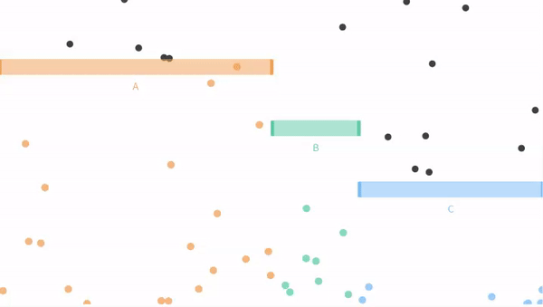
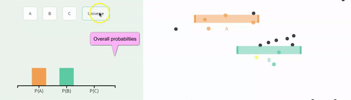
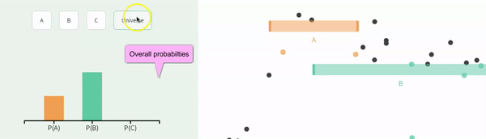
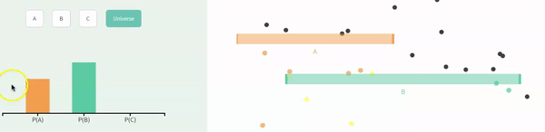
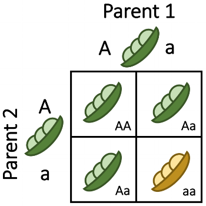
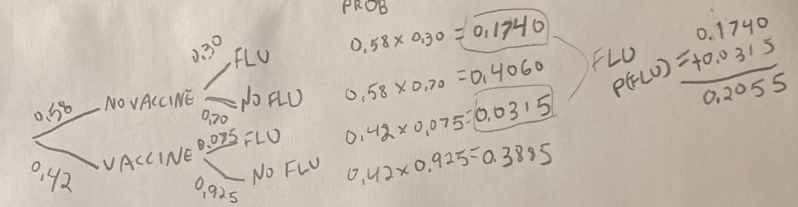

# (PART) Probability and hypothesis testing {-}

# Probabilistic thinking {#prob1}

```{r, echo = FALSE, warning=FALSE, message=FALSE}
library(tidyverse)
library(DT)
library(knitr)
library(blogdown)
library(stringr)
library(tweetrmd)
library(emo)
library(tufte)
library(cowplot)
library(lubridate)
library(ggthemes)
library(ggforce)
library(datasauRus)
library(ggridges)
library(randomNames)
library(infer)
options(crayon.enabled = FALSE)   
html_tag_audio <- function(file, type = c("mp3")) {
  type <- match.arg(type)
  htmltools::tags$audio(
    controls = "",
    htmltools::tags$source(
      src = file,
      type = glue::glue("audio/{type}", type = type)
    )
  )
}
```


```{block2, type='rmdnote'}
These notes accompany portions of Chapter 5  --- *Probability* --- of our textbook, which we also examine in the [next section](#prob2).   **The reading below is required,**  @whitlock2020 is  not.    
```


<span style="color: Blue;font-size:22px;">   Motivating scenarios:  </span>  <span style="color: Black;font-size:18px;">  We want to understand how seemingly important patterns can arise by chance, how to think about chance events, how to think quantitatively about chance events, and gain an appreciation for a foundational concern of statistics and how the filed addresses this concern. </span> 
 
**Learning goals: By the end of this chapter you should be able to**   

- Provide a working definition of probability.  
- Explain why we need to think about probability when interpreting data.     
- Consider a proportion as an estimate as random outcome of a population parameter.      
- Recognize that "Random" does not mean "No clue".   
- Understand conditional probabilities and non-independence.  


```{block2, type='rmdwarning'}
In addition to this reading,  the other assignment is to **listen to 5 minutes (4:10 - 9:10) of the** *No coincidence, No story* **[Episode of This American Life](https://www.thisamericanlife.org/489/no-coincidence-no-story), embedded below**.  
```


```{r echo  = FALSE, fig.cap = "hello"}
html_tag_audio("images/images_nocoincidence.mp3", type = "mp3")
```


## Why do we care about probability?   

So, our (and many) statistics textbook(s) has a chapter on probability, before it gets in to much statistics. Why is that, and why am I keeping this chapter here? For me there are three important and inter-related  reasons that we should think about probability before delving too deep into statistics.   

```{r, echo=FALSE,out.width='30%', echo=FALSE,out.extra='style="float:right; padding:10px"'}
include_graphics("https://imgs.xkcd.com/comics/sports.png")
```

1. **Many important biological processes are influenced by chance.** In my own field of genetics, we know that mutation, recombination and which grandparental allele you inherit are all chance events. If you get a transmissible disease after modest exposure is a chance event. Even apparently highly coordinated and predictable gene expression patterns can arise from many chance events.  It is therefore critical to get an intuition for how chance (random) events happen. <span style="color:lightgrey;">It is fun to philosophically consider if these things are really chance, or if they were all predestined, or if we could make perfect predictions with more information etc. etc. etc. While this is fun, it is not particularly useful -- whether or not something is predestined, we can only use the best information we have to make probabilistic statements. </span>


2. **We don't want to tell biological stories about coincidences.** A key lesson from probability theory is that some outcome will happen. So, for every coincidence in the podcast above, there are tens of thousands of cases where something uninteresting happened. For example, no one called This American Life to tell them that somehow their grandmother was not in a random picture their friend sent them (*No coincidence, no story*).  Similarly, we don't want to tell everyone that covid restores lactose tolerance just because someone in our extended social network lost his lactose intolerance after recovering from covid. Much of statistics is simply a mathematical contraption, built of probability theory, to help us judge if our observations are significant or if they are a mere coincidence.   


3. **Understanding probability helps us interpret statistical results** Confidence intervals, the sampling distribution, p-values, and a host of other  statistical concepts are notoriously confusing. Some of this is because they are strange and confusing topics, but a large contributor is that people come across these terms without a foundation in probability. In addition to helping us understand statistical concepts, probabilistic thinking can help us understand many seemingly magical or concerning observations in the scientific literature. For example, later in this class, we will see that attempts to replicate exciting experimental results often fail, and that the effect of a treatment tends to get smaller the longer we study it. Amazingly, understanding a little about probability and a little about how scientists work can explain many of these observations.  

Luckily, none of his requires serious expertise in probability theory -- while I recommend taking a bunch of probability theory courses (because it's soooo fun), a quick primer, like we're working through here is quite powerful!   

**Perhaps the most important take home message from all of this is that random does not mean equal probability, and does not mean we have no clue. In fact, we can often make very good predictions about the world by considering how probability works. **   


## Probability Concepts  

### Sample space

When we think about probability, we first lay out all potential outcomes (formally known as **sample space**). 


The most straightforward and common example of sample space is the outcome of a coin flip. Here the states are 

```{r, echo=FALSE, out.width="30%", out.extra='style="float:right; padding:10px"'}

```

- Coin lands heads side up 
- Coin lands tails side up   

However, probabilistic events can have more than two potential outcomes, and need not be 50:50 affairs. 

Consider a single ball dropping in Figure \@ref(fig:exclusivefull), the **sample space** is: 

- The ball can fall through the orange bin (<span style="color:#EDA158;">A</span>).     
- The ball can fall through the green bin (<span style="color:#62CAA7;">B</span>).   
- The ball can fall through the blue bin (<span style="color:#98C5EB;">C</span>).   


```{r exclusivefull, out.width='60%',echo=FALSE, fig.cap = 'An example of probability example from [Seeing Theory](https://seeing-theory.brown.edu/) (gif on 8.5 second loop). Here outcomes <span style="color:#EDA158;">A</span>, <span style="color:#62CAA7;">B</span>, and <span style="color:#98C5EB;">C</span> are mutatually exclusive and make up all of sample space.'}

```


*This view of probability sets up two simple truths*      

1. After laying out sample space, some outcome is going to happen.     
2. Therefor adding up (or integrating) the probabilities of all outcomes in sample space will sum to one.   

Point (1) helps us interpret coincidences -- something had to happen (e.g. the person in the background of a photo had to be someone...) and we pay more attention when that outcome has special meaning (e.g. that someone was my grandmother).

### Probabilities and proportions   

#### Probabilities {-}


A **probability describes a parameter for a population.** So in our example if we watch the balls drop forever and counted the proportion we would have the parameter.   Or assuming that balls fall with equal probability across the line (they do) we can estimate the probabilities by the proportion of space each bar takes up in Figure \@ref(fig:exclusivefull). We see that <span style="color:#EDA158;">A</span> takes up half of sample space, that <span style="color:#62CAA7;">B</span> takes up 1/6 or sample space, and that <span style="color:#98C5EB;">C</span>takes up about 2/6 of sample space.         So the probability of a given event P(event): 

- P(<span style="color:#EDA158;">A</span>) = 3/6.    
- P(<span style="color:#62CAA7;">B</span>) = 1/6.     
- P(<span style="color:#98C5EB;">C</span>) = 2/6.        


```{r probdist, fig.cap = 'The **probability distribution** for the dropping balls example in Figure 12.1. Any probability distribution must sum to one.  Strictly speaking,  categorical and discrete variables can have probability distributions. Continuous variables have probability densities because the probability of observing any specific number is approximately zero. So probability densities integrate to one. ', echo=FALSE, fig.height=2, fig.width=3, out.extra='style="float:right; padding:10px"'}
ggplot(tibble(event = c("A","B","C"),
              prob  = c(1/2,1/6,1/3)),
       aes(x = event , y = prob, fill = event)) +
  geom_col(show.legend = FALSE)+
  scale_fill_manual(values = c("#EDA158","#62CAA7","#98C5EB"))+
  scale_y_continuous(limits = c(0,1), breaks = round(seq(0,1,1/3),digits = 2))+
  labs(title = "Sample snapshot")
```


#### Proportions {-}  

 **The proportion** of each outcome is the number of  times we see that outcome divided by the number of times we seen any outcome -- that is,  the **proportion describes an estimate from a sample**. Let's look at a snapshot of a single point in time from Figure \@ref(fig:exclusivefull):  

```{r  echo=FALSE}

```

We count 15 balls - 10 orange (<span style="color:#EDA158;">A</span>), 2 green (<span style="color:#62CAA7;">B</span>), and 3 blue (<span style="color:#98C5EB;">C</span> ). 

Here, the proportion of:   


- <span style="color:#EDA158;">A</span> = 10/15 = 2/3 = $0.66\overline{66}$.    
- <span style="color:#62CAA7;">B</span> = 2/15 =  $0.13\overline{33}$.   
- <span style="color:#98C5EB;">C</span>  = 3/15 =  1/5 = $0.20$.  

Note that these proportions (which are estimates from a sample) differ from the probabilities (the true population parameters) because of sampling error.


### Exclusive vs non-exclusive events  

A flipped coin will land heads up or tails up -- it cannot land on both sides at once. Outcomes that cannot occur at the same time are **mutually exclusive**.     

A coin we find on the ground could  be heads up or heads down (**mutually exclusive**), and could be a penny or nickel or dime or quarter etc (also **mutually exclusive**).  

But a coin can be both heads up and a quarter. These are nonexclusive events. **Non-exclusive** events are cases were the occurrence of one outcome does not exclude the occurrence of another.


#### Exclusive events   {-}


Keeping with our con flipping idea, let's use the app from [seeing theory](https://seeing-theory.brown.edu/basic-probability/index.html#section1), below, to explore the outcomes of one or more exclusive events.  

- Change the underlying probabilities away from 50:50 (so the coin toss is unfair).      
- Then toss the coin once.
- Then toss the coin again, and repeat this four times.   
- Finally toss it one hundred times.

**Be sure to note the probabilities you chose, the outcomes of the first five tosses, and the proportion of heads and tails over all coin flips.**


```{r, echo=FALSE}
include_app("https://seeing-theory.brown.edu/basic-probability/index.html#section1", height = '800px')
```


#### Non-Exclusive events   {-}  

In Figure \@ref(fig:exclusivefull), the balls falling through  <span style="color:#EDA158;">A</span>, <span style="color:#62CAA7;">B</span>, and <span style="color:#98C5EB;">C</span> were mutually exclusive -- a ball could not fall through both  <span style="color:#EDA158;">A</span> and <span style="color:#62CAA7;">B</span>, so all options where mutually exclusive.  

This need not be true. The outcomes could be non-exclusive (e.g. if the bars were arranged such that a ball could fall on <span style="color:#EDA158;">A</span> and then <span style="color:#62CAA7;">B</span>). 

Figure \@ref(fig:indepA) shows a case when falling through <span style="color:#EDA158;">A</span> and <span style="color:#62CAA7;">B</span> are not exclusive.     

```{r, indepA, fig.cap = '**Non-exclusive events:** Balls can go through <span style="color:#EDA158;">A</span>, <span style="color:#62CAA7;">B</span>, <span style="color:gold;">both</span>, or **neither**.', echo = FALSE, out.width="50%"}
include_graphics("images/indep.gif")
```

### Conditional probabilities and (non-)independence  


> **Conditional probabilities** allow us to account for information we have about our system of interest. For example, we might expect the probability that it will rain tomorrow (in general) to be smaller than the probability it will rain tomorrow given that it is cloudy today. This latter probability is a conditional probability, since it accounts for relevant information that we possess.     
>
> Mathematically, computing a conditional probability amounts to shrinking our sample space to a particular event. So in our rain example, instead of looking at how often it rains on any day in general, we "pretend" that our sample space consists of only those days for which the previous day was cloudy. We then determine how many of those days were rainy.    
>
> `r tufte::quote_footer('--- [Seeing Theory](https://seeing-theory.brown.edu/compound-probability/index.html#section3)')`


In mathematical notation,  | symbol denotes conditional probability.  So, for example, $P(A|C)=0$ means that if we know we have outcome $C$ there is no chance that we also had outcome $A$ (i.e. $A$ and $C$ are mutually exclusive.  


```{block2, type='rmdwarning'}
For some terrible reason  

`|` means *or* to R    
`|` means "conditional on" in stats. 

This is confusing and unfortunate, and I am very sorry.   
Stay safe.
```


#### Independent events {-}  

Events are **independent** if the the occurrence of one event provides no information about the other.   Figure \@ref(fig:indepB) displays a situation identical to \@ref(fig:indepB) - but also shows conditional probabilities.  In this example, the probability of A is the same whether or not the ball goes through B (and vice versa).  


```{r indepB,echo=FALSE, fig.cap = '**Conditional independence.** These probabilities in this plot are the same as the figure [above](fig:nonexclusivefull). We reveal the probability of all outcomes, conditional on one other outcome by clicking on the outcome we are conditioning on (e.g. we see P(<span style="color:#EDA158;">A</span>|<span style="color:#62CAA7;">B</span>), after clicking on <span style="color:#62CAA7;">B</span> (which also reveals that P(<span style="color:#62CAA7;">B</span>|<span style="color:#62CAA7;">B</span>) = 1)). Here <span style="color:#EDA158;">A</span> and <span style="color:#62CAA7;">B</span> are independent. That is,  P(<span style="color:#EDA158;">A</span>|<span style="color:#62CAA7;">B</span>) =  P(<span style="color:#EDA158;">A</span>), and   P(<span style="color:#62CAA7;">B</span>|<span style="color:#EDA158;">A</span>) =   P(<span style="color:#62CAA7;">B</span>). Explore for yourself at the Seeing Theory [website](https://seeing-theory.brown.edu/compound-probability/index.html#section3).'}

```


$###  Non-independence   {-}  

Events are **non-independent** if their conditional probabilities differ from their unconditional probabilities.   We've already seen an example of non-independence. If events *a* and *b* are mutually exclusive, $P(A|B) =  P(B|A) = 0$, while $P(A|B) \neq P(A)$ and $P(B|A) \neq P(B)$. 


**Independence vs non-independence is very important for both basic biology and its applications.** For example, say we're all getting a vaccine and some people get sick with some other disease. If these where independent -- i.e. the proportion of sick people was roughly similar in the vaccinated and the unvaccinated group, we would probably feel ok about mass vaccination. On the other hand, if we saw an excess of sickness in the vaccine group, we would feel less good about it. That said, non-independence does not imply a causal link (e.g. the vaccinated people might socialize more, exposing themselves to the other disease, so we would want to see if we could disentangle correlation and causation before joining the local anti-vax group).  


Figure \@ref(fig:nonindepA) shows an example of non-independence:    

- The probability of <span style="color:#EDA158;">A</span>, P(<span style="color:#EDA158;">A</span>) =  <span style="color:#EDA158;">$\frac{1}{3}$</span>.      
- The probability of <span style="color:#EDA158;">A</span> conditional on <span style="color:#62CAA7;">B</span>, P(<span style="color:#EDA158;">A</span>|<span style="color:#62CAA7;">B</span>) =  <span style="color:#EDA158;">$\frac{1}{4}$</span>.           

- The probability of <span style="color:#62CAA7;">B</span>, P(<span style="color:#62CAA7;">B</span>) = <span style="color:#62CAA7;">$\frac{2}{3}$</span>.      
- The probability of <span style="color:#62CAA7;">B</span> conditional on <span style="color:#EDA158;">A</span>, P(<span style="color:#62CAA7;">B</span>|<span style="color:#EDA158;">A</span>) =  <span style="color:#62CAA7;">$\frac{1}{2}$</span>.        


```{r nonindepA, echo=FALSE, fig.cap = '**Non-independence:** We would change our grobability that the ball fell through <span style="color:#EDA158;">A</span>  if we knew it fell through <span style="color:#62CAA7;">B</span>, and vice versa, so these variables are nonindependent. We reveal the probability of all outcomes, conditional on one other outcome by clicking on the outcome we are conditioning on (e.g. we see P(<span style="color:#EDA158;">A</span>|<span style="color:#62CAA7;">B</span>), after clicking on <span style="color:#62CAA7;">B</span>. Explore for yourself at the Seeing Theory [website](https://seeing-theory.brown.edu/compound-probability/index.html#section3).'}

```


## Probability Rules


I highly recommend a formal probability course would go through a bunch of ways to calculate probabilities of alternative outcomes (probability theory was my favorite class). But you don't need all that here. We simply want to get an intuition for probability, which we can achieve by familiarizing ourselves with some straightforward rules.

Internalizing the rough rules below will get you pretty far:    

- **Add** probabilities to find the probability of one outcome **OR** another. (be sure to subtract off double counting).     

- **Multiply** probabilities to find the probability of one outcome **AND** another. (be sure to consider conditional probabilities if outcomes are non-independent.)     

OK -- Let's work through these rules.

```{block2, type='rmdnote'}
Below, we talk about the probability of events *a* and *b*. These are generic events that can stand in for any random thing, so $P(a)$ is the probability of some event *a*. So if *a* was red head, p(*a*) is the probability that a person is a red head.
I distinguish this from <span style="color:#EDA158;">A</span>, <span style="color:#62CAA7;">B</span>, and <span style="color:#98C5EB;">C</span>, which refer to balls dropping through colored bars in our visualizations.  
```


### Add probabilities for **OR** statements  

To find the probability  or this or that we sum all the ways we can be this or that, being careful to avoid double-counting.   


\begin{equation} 
\begin{split}
P(a\text{ or }b) &= P(a) + P(b) - P(ab)\\
\end{split}
(\#eq:or)
\end{equation} 

where *P(ab)* is the probability of outcomes *a* and *b*.     

#### **Special case of exclusive outcomes** {-}

**If outcomes are mutually exclusive, the probability of outcome of both of them,** *p(ab)* **is zero, so the probability of** *a* **or** *b* **is**  

\begin{equation} 
\begin{split}P(a\text{ or }b | P(ab)=0) &= P(a) + P(b) - P(ab)\\
 &= P(a) + P(b) - 0\\
 &= P(a) + P(b)
\end{split}
\end{equation} 

Returning to the example in \@ref(fig:exclusivefull) [presented again below]


```{r exclusivefullrevist, out.width='45%',echo=FALSE, out.extra='style="float:right; padding:10px"'}

```

In which

- P(<span style="color:#EDA158;">A</span>) = <span style="color:#EDA158;">3/6</span>.    
- P(<span style="color:#62CAA7;">B</span>) = <span style="color:#62CAA7;">1/6</span>.     
- P(<span style="color:#98C5EB;">C</span>) = <span style="color:#98C5EB;">2/6</span>.      

**The probability the ball goes through   <span style="color:#EDA158;">A</span> OR  <span style="color:#62CAA7;">B</span> is**       
<span style="color:#EDA158;">3/6</span> **+** <span style="color:#62CAA7;">1/6</span>    = 4/6   = 2/3.


We often use this rule to find the probability of a range of outcomes for discrete variables (e.g. the probability that the sum of two dice rolls is between six and eight  = P(6) + P(7) + P(8)). 


#### **General case** {-}

**More generally, the probability of outcome a or b is P(a) + P(b) - P(a b)** [Equation \@ref(eq:or)]. This subtraction <span style="color:lightgrey;">(which is irrelevant for exclusive events, because in that case $P(ab) = 0$)</span> avoids double counting. 

**Why do we subtract P(a and b) from P(a) + P(b) to find P(a or b)?** Figure \@ref(fig:dontdoublecount) shows that this subtraction prevents double-counting -- the sum of falling through A or B is $0.50 + 0.75 = 1.25$. Since probabilities cannot exceed one, we know this is foolish -- but we must subtract to avoid double counting even when the sum of probabilities do not exceed one.

```{r dontdoublecount, echo=FALSE, fig.cap = '**Subtract P(ab) to avoid double counting:** Another example of probability example from [Seeing Theory](https://seeing-theory.brown.edu/) (gif on 6 second loop).', out.width='80%'}

```

Following equation \@ref(eq:or) and estimating that about 35% of balls falls through  <span style="color:#EDA158;">A</span> and <span style="color:#62CAA7;">B</span>, we find that      
P(<span style="color:#EDA158;">A</span> or <span style="color:#62CAA7;">B</span>) = P(<span style="color:#EDA158;">A</span>) + P(<span style="color:#62CAA7;">B</span>) - P(<span style="color:gold;">AB</span>)        
P(<span style="color:#EDA158;">A</span> or <span style="color:#62CAA7;">B</span>) =  <span style="color:#EDA158;">0.50</span> + <span style="color:#62CAA7;">0.75</span> - <span style="color:gold;">0.35</span>   
P(<span style="color:#EDA158;">A</span> or <span style="color:#62CAA7;">B</span>) = 0.90.

For a simple and concrete example, the probability a random student played soccer or ran track in high school, is the probability they played soccer  *plus* the probability they ran track *minus* the probability they  played soccer and ran track.  


#### The probability of not  {-}   

My favorite thing about probabilities is that they have to sum (or integrate) to one. This helps us be sure we laid out sample space right, and allows us to check our math. It also provides us with nice math tricks. 

Because probabilities sum to one, the **probability of "not a" equals 1 - the probability of a**. This simple trick often makes hard problems a lot easier.


### Multiply probabilities for **AND** statements  

The probability of two types of events in an outcome e.g. the probability of *a* and *b* equals the probability of *a* times the probability of *b* conditional on *a*, which will also equal the probability of *b* times the probability of *a* conditional on *b*.    


\begin{equation} 
\begin{split}
P(ab) &= P(a) \times P(b|a)\\
 & = P(b) \times P(a|b)
\end{split}
(\#eq:and)
\end{equation} 

#### Special cases of AND {-}   

- **If two outcomes are mutually exclusive**, the probability of one conditional on the other is zero ($P(b|a) = 0$). So  the probability of  one given the other is zero ($P(a) \times P(b|a) = P(a) \times 0 = 0$).  

- **If two outcomes are independent**, the probability of one conditional on the other is simply its overall probability ($P(b|a) = P(b)$). So  the probability of one given the other is the product of their overall probabilities zero ($P(a) \times P(b|a) = P(a) \times P(b)$).  

```{r fig.cap = 'A Punnett Square is a classic example of indepndent probabilities  <span style="color:lightgrey;">(Image from the [Oklahoma Science Project](https://okscienceproject.org/lesson-2-punnett-squares))</span>.', out.width='30%', echo=FALSE,out.extra='style="float:right; padding:10px"'}

```

The Punnett square is a classic example of independent probabilities in genetics as the sperm genotype usually does not impact meiosis in eggs (but see [my paper](https://www.ncbi.nlm.nih.gov/pmc/articles/PMC5539998/) [@brandvain2015] about exceptions and the consequences for fun). If we cross two heterozygotes, each transmits their recessive allele with probability $1/2$, so the probability of being homozygous for the recessive allele when both parents are heterozygous is $\frac{1}{2}\times \frac{1}{2} = \frac{1}{4}$.   


#### The general cases of AND {-}   

The outcome of meiosis does not depend on who you mate with, but in much of the world context changes probabilities. When outcomes are nonexclusive, we find the probability of both *a* and *b* by multiplying the probability of a times the probability of *b* conditional on observing *a*, $P(ab) =P(a) \times P(b|a)$ [Eq. \@ref(eq:and)].     


##### **CONDITIONAL PROBABILITY VISUAL:**  {-}   

Let's work through a visual example!   

```{r, echo=FALSE}
    
```

In the figure above     
P(<span style="color:#EDA158;">A</span>) = <span style="color:#EDA158;">1/3</span>,    
P(<span style="color:#62CAA7;">B</span>) = <span style="color:#62CAA7;">2/3</span>,    
P(<span style="color:#EDA158;">A</span>|<span style="color:#62CAA7;">B</span>) =  <span style="color:#EDA158;">1/4</span>, and      
P(<span style="color:#62CAA7;">B</span>|<span style="color:#EDA158;">A</span>) =  <span style="color:#62CAA7;">1/2</span>.   

Using Equation \@ref(eq:and), we find the probability of A and B:    
P(<span style="color:gold;">AB</span>) = P(<span style="color:#EDA158;">A</span>) $\times$ P(<span style="color:#62CAA7;">B</span>|<span style="color:#EDA158;">A</span>)  = P(<span style="color:#EDA158;">A</span>) = <span style="color:#EDA158;">1/3</span>  $\times$ <span style="color:#62CAA7;">1/2</span>    =  <span style="color:gold;">1/6</span>.      
Which is the same as    
P(<span style="color:gold;">AB</span>) = P(<span style="color:#62CAA7;">B</span>) $\times$ P(<span style="color:#EDA158;">A</span>| <span style="color:#62CAA7;">B</span>)  =  <span style="color:#62CAA7;">2/3</span> $\times$ <span style="color:#EDA158;">1/4</span> =  <span style="color:gold;">2/12</span>=  <span style="color:gold;">1/6</span>.   

We can see this visually in Figure \@ref(fig:counting):    

```{r counting, fig.cap = 'A representation of the relative probabilities of each outcome in sample space. Color denotes outcome (which is also noted with black letters), and each box represents a probability of one sixth.', fig.height=1, fig.width=1.5, echo = FALSE, ,out.extra='style="float:left; padding:10px"'}
tibble(x = rep(1:3, each = 2), y = rep(1:2,times = 3), 
       z= c(rep("A",1),rep("AB",1),rep("B",3),rep("x",1))) %>%
  mutate(z =factor(z, levels = c("A","AB","B","x")))   %>%
  ggplot(aes(x=x,y=y,fill =z))+
  geom_tile(color = "black",show.legend = FALSE)+
  scale_fill_manual(values = c("#EDA158","yellow","#62CAA7","black"),drop = FALSE)+
    theme_tufte()+
  theme(axis.title = element_blank(), 
        axis.text = element_blank(),
        legend.position = "bottom", 
        legend.title = element_blank(),
        axis.ticks = element_blank())+
  geom_text(aes(label = z),show.legend = FALSE)
#  labs(title = "Probability of each outcome")
```


##### **CONDITIONAL PROBABILITY REAL WORLD EXAMPLE:**  {-}   


You are way less likely to get the flu if you get the flu vaccine.     
So, what is the probability that a random person got a flu vaccine and got the flu?     
First, we lay out some rough probabilities:   

```{r, out.width = '30%', out.extra='style="float:right; padding:10px"',echo=FALSE}
include_graphics("https://images.everydayhealth.com/images/no-flu-shot-and-now-you-have-the-flu-what-to-do-722x406.jpg?w=1110")
```

- Every year, a little more than half of the population gets a flu vaccine, let us say P(No Vaccine) = 0.58.        

- About 30% of people who do not get the vaccine get the flu, P(Flu|No Vaccine) = 0.30.      
- The probability of getting the flu diminishes by about one-fourth among the vaccinated, P(Flu|Vaccine) =  0.075.  

But we seem stuck, what is $P(\text{Vaccine})$?    We can find this as $1 - P(\text{no vaccine}) = 1 - 0.58 = 0.42$.   

Now we find P(Flu and Vaccine) as P(Vaccine) x P(Flu | Vaccine) = 0.42 x 0.075 = 0.0315.   

### The law of total probability    

Let's say we wanted to know the probability that someone caught the flu.  How do we find this?   

We learned in Chapter \@ref(prob1) that the probability of all outcomes in sample space has to sum to one. Likewise, the probability of all ways to get some outcome have to sum to the probability of getting that outcome:    

\begin{equation} 
P(b) = \sum P(a_i) \times P(b|a_i)
(\#eq:tot)
\end{equation} 

The $\sum$ sign notes that we are going over all possible outcomes of $a$, and the subscript, $_i$, indexes these potential outcomes of $a$.  In plain language, **we find probability of some outcome** by     

1. Writing down all the ways we can get it,       
2. Finding the probability of each of these ways,    
3. Adding them all up.    

So for our flu example, the probability of having the flu is the probability of being vaccinated and having the flu, plus the probability of not being vaccinated and catching the flu <span style="color:lightgrey;">(NOTE: We don't subtract anything off because they are mutually exclusive.)</span>. We can find each following the general multiplication principle \@ref(eq:and):     

\begin{equation} 
\begin{split}
P(\text{Flu}) &= P(\text{Vaccine}) \times P(\text{Flu}|\text{Vaccine})\\ 
&\text{ }+ P(\text{No Vaccine}) \times  P(\text{Flu}|\text{No Vaccine})  \\
&=  0.42  \times 0.075 + 0.58 \times 0.30\\ 
&=  0.0315 + 0.174\\ 
&= 0.2055
\end{split}
\end{equation}


### Probability trees   

It can be hard to keep track of all of this. Probability trees are a tool we use to help. To make a probability tree, we   

1. Write down all potential outcomes for *a*, and use lines to show their probabilities.  
2. We then write down all potential outcomes for *b* separately for each potential a, and connect each a to these outcomes with a line denoting the conditional probabilities.   
3. Keep going for events *c*, *d*, etc...    
4. Multiply each value on path to get the probability of that path (The general multiplication rule, Equation \@ref(eq:and)).     
5. Add up all paths that lead to the outcome you are interested in. <span style="color:lightgrey;">(NOTE: Again, reach path is exclusive, so we don't subtract anything.)</span>   

Here is a probability tree I drew for the flu example. Reassuringly the probability of getting the flu matches our math above.   

```{r, echo=FALSE}

```


### Flipping conditional probabilities    {#bayes}

The probability that a vaccinated person gets the flu, P(Flu|Vaccine) is 0.075.    
But what is the probability that someone who has the flu got vaccinated, P(Vaccine|Flu)?   

**The way to think about this is to find the number of people who are vaccinated AND get the flu, and divide by the number of people who get the flu.** Turning these into probabilities, rather than counts), and applying our probability rules, provides us with a mathy way to do this. That is, The probability that someone who has the flu got vaccinated equals the probability that someone got the flu and was vaccinated, divided by the probability that someone has the flu.   

\begin{equation} 
\begin{split}
P(\text{Vaccine|Flu}) &= P(\text{Vaccine and Flu}) / P(\text{Flu}) \\
P(\text{Vaccine|Flu}) &= \tfrac{P(\text{Flu|Vaccine}) \times P(\text{Vaccine})}{P(\text{Vaccine}) \times P(\text{Flu}|\text{Vaccine}) + P(\text{No Vaccine}) \times  P(\text{Flu}|\text{No Vaccine})}\\
P(\text{Vaccine|Flu}) &= 0.0315 / 0.2055 \\ 
P(\text{Vaccine|Flu}) &=0.1533  
\end{split}
\end{equation}

So, while the vaccinated make up 42% of the population, they only make up 15% of people who got the flu.

The numerator on the right hand side,  $P(\text{Vaccine and Flu})$, comes from the general multiplication rule (Eq. \@ref(eq:and)).   
The denominator on the right hand side, $P(\text{Flu})$, comes from the law of total probability (Eq. \@ref(eq:tot)). 

This is an application of **Bayes' theorem**. Bayes' theorem is a math trick which allows us to flip conditional probabilities as follows 

\begin{equation} 
\begin{split}
P(A|B) &= \frac{P(A\text{ and }B)}{P(B)}\\ 
P(A|B) &= \frac{P(B|A) \times P(A)}{P(B)}
\end{split}
(\#eq:bayes)
\end{equation} 


```{block2, type='rmdnote'}
This reversal of conditional probabilities is critically important in many arenas, especially the proper interpretation of medical test results.   Additionally, this way of thinking has spawned a whole branch of statistics, known as Bayesian statistics. While Bayesian statistics is not the focus of this class, we will discuss it from time to time.
```


## Probabilitic thinking by simulation: Quiz and Summary  

Go through all "Topics" in the `learnR` tutorial, below. Nearly identical will be homework on canvas.

```{r, echo=FALSE}
include_app("https://brandvain.shinyapps.io/prob1/",height = '800')
```


## Probabilistic thinking: Critical definitions   {-}   

```{block2, type='rmddef'}
**Sample space:** All the potential outcomes of a random trial.  

**Probability:** The proportion of events with a given outcome if the random trial was repeated many times, 

**Mutually exclusive:** If one outcome excludes the others, they are mutually exclusive.  

**Conditional probability:** The probability of one outcome, if we know that some other outcome occurred.  


**Independent:** When one outcome provides no information about another, they are independent.  

**Non-Independent:** When knowing one outcome changes the probability of another, they are non-independent.   
```


```{r, echo=FALSE}
rm(list = ls())
```
