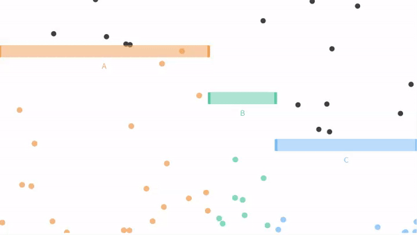
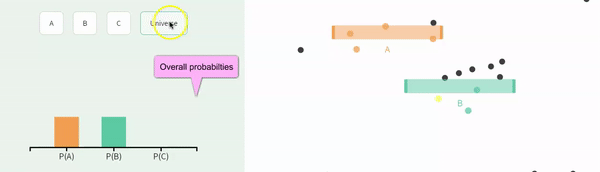

# Simulate for Probabilistic thinking {#prob2}

```{r, echo = FALSE, warning=FALSE, message=FALSE}
library(tidyverse)
library(DT)
library(knitr)
library(blogdown)
library(stringr)
library(tweetrmd)
library(emo)
library(tufte)
library(cowplot)
library(lubridate)
library(ggthemes)
library(ggforce)
library(datasauRus)
library(ggridges)
library(randomNames)
library(infer)
library(tiktokrmd)
options(crayon.enabled = FALSE)   
```


```{block2, type='rmdnote'}
These notes accompany portions of Chapter 5  --- *Probability* --- of our textbook, which we also examine in the [previous section](#prob1).   **The reading below is required,**  @whitlock2020 is  not.    
```


<span style="color: Blue;font-size:22px;">   Motivating scenarios:  </span>  <span style="color: Black;font-size:18px;">  We want to build an intuitive feel for probability that we can build from simulation. </span> 
 
**Learning goals: By the end of this chapter you should be able to**   

- Develop simulations to solidify our probabilistic intuition.  


```{block2, type='rmdwarning'}
In addition to this reading,  the other assignment is to read [this paper](https://drive.google.com/uc?export=download&id=1YBEE6pES415uQalTIEhaA-UD9u-l2D_5) [@humphrey2016].  
```


## Why Simulate?    

A lot of statistics is wrapping our heads around probabilistic thinking. To me the key here is to get good intuition for probabilistic thinking. Mathematical formulae (like those introduced  last chapter) are essential for rapid computation and help some people understand the concepts. But I personally understand things better when I see them, so I often simulate. 

I simulate to:    

1. Make sure my math is right.   
2. Build intuition for probability problems.   
3. Solve probability questions that do not have a mathematical solution.  

So, how do we simulate? Last Chapter we introduced some simulation that was built into the [seeing theory app](https://seeing-theory.brown.edu/basic-probability/index.html), but that app will not store our output or keep a record of our code.  

More naturally, we can code probabilistic events. We can use a bunch of `R` functions to simulate, depending on our goals. Today, we'll    the [`sample()`](https://stat.ethz.ch/R-manual/R-devel/library/base/html/sample.html) function, which we saw when we considering sampling and uncertainty in our estimates.


**Our goal is to use simulation to reinforce concepts in probability and to develop an intuition for probabilistic  outcomes. This should solidify our mathematical understanding of the rules of probability developed in the previous chapter.**


## Simulating exclusive events with the [`sample()`](https://stat.ethz.ch/R-manual/R-devel/library/base/html/sample.html) function in `R`    

While I love the seeing theory app, it is both limiting and does not store our outoput or keep a record of our code. Rather we use the [`sample()`](https://stat.ethz.ch/R-manual/R-devel/library/base/html/sample.html) function in `R`.   


```{r, echo=FALSE, out.width="30%", out.extra='style="float:right; padding:10px"'}

```

Let's simulate the simple our coin-tossing example introduced in the previous chapter to get started. Remember that of  sample space for a single coin flip is   

- Coin lands heads side up    
- Coin lands tails side up   

To flip a single coin with a 40\% chance of landing heads up, we type:    

```{r}
sample(x = c("Heads","Tails"), size = 1, replace = TRUE, prob = c(.4,.6))
```

To flip a sample of five coins, each with a 45\% chance of landing tails up, we type:    

```{r}
sample(x = c("Heads","Tails"), size = 5, replace = TRUE, prob = c(.55,.45))
```

If we do not give `R` a value for `prob` (e.g. `x = c("Heads","Tails"), size = 5, replace = TRUE)`) it assumes that each outcome is equally probable.    


### **Keeping track of and visualizing simulated proportions from a single sample in `R`**    {-}   
 
 
```{r exclusivefullrevisit, out.width='60%',echo=FALSE}

```
 
  
Now let us move on from our coin flipping example to our ball dropping examples from seeing theory.  Remember that potential outcomes are  


- The ball can fall through the orange bin (<span style="color:#EDA158;">A</span>), with probability P(<span style="color:#EDA158;">A</span>) = 3/6.        
- The ball can fall through the green bin (<span style="color:#62CAA7;">B</span>), with probability P(<span style="color:#62CAA7;">B</span>) = 1/6.     
- The ball can fall through the blue bin (<span style="color:#98C5EB;">C</span>) with probability  P(<span style="color:#98C5EB;">C</span>) = 2/6.   


We can set these probabilities in `R`  by assigning each to a variable, as follows


```{r}
P_A      <- 3/6  # aka 1/2
P_B      <- 1/6  # aka 1/6
P_C      <- 2/6  # aka 1/3
```
 
We can then write a signle line of R code, to select ten balls with replacement   

```{r}
sample(c("A", "B", "C"), size = 10, replace = TRUE, prob = c(P_A, P_B, P_C))
```

The code above produces a vector, but we most often want data in tibbles. 
Let's do this, but for funzies, lets make a sample of five hundred balls, with probabilities equal to those in Figure above. To do so, we simply make a tibble and assign our vector to a column  


```{r}
n_balls  <- 500
ball_dist_exclusive <- tibble(balls = sample(x = c("A","B","C"), 
                                  size  = n_balls, 
                                  replace = TRUE, 
                                  prob = c(P_A, P_B, P_C)))
```

**Let's have a look at the result**

```{r echo=FALSE,fig.width=5}
DT::datatable(ball_dist_exclusive,
              options = list(autoWidth = TRUE,pageLength = 5, lengthMenu = c(5, 25, 50),
                             columnDefs=list(list(targets=1, class="dt-right"),
                                             list(width = '20px', targets = 1)
                                             )))
```

**Let's summarize the results**  

There are a few tidyverse tricks we can use to find proportions.    

- We can do this for all outcomes at once by    

1. First [`group_by`](https://dplyr.tidyverse.org/reference/group_by.html) the outcome... e.g. `group_by(balls, .drop = FALSE)`, where `.drop=FALSE` tells R we want to know if there are zero of some outcome.  And     
2.  Use the [`n()`](https://dplyr.tidyverse.org/reference/n.html) function inside of [`summarise()`](https://dplyr.tidyverse.org/reference/summarise.html).   

```{r, message=FALSE, warning=FALSE}
ball_dist_exclusive %>% 
    group_by(balls, .drop = FALSE) %>%
    dplyr::summarise(count = n(), proportion = count / n_balls)
```

Or we can count these ourselves by.

1.`sum`ing the number of times balls fall through <span style="color:#EDA158;">A</span>, <span style="color:#62CAA7;">B</span>, and <span style="color:#98C5EB;">C</span> inside of the [`summarise()`](https://dplyr.tidyverse.org/reference/summarise.html) function, without grouping by anything.  


```{r, message=FALSE, warning=FALSE}
ball_dist_exclusive %>% 
    dplyr::summarise(n_A = sum(balls == "A") ,
              n_B = sum(balls == "B"),
              n_C = sum(balls == "C"))
```


**Let's make a nice plot**

```{r, ballsim1,fig.width=3, fig.height=2}
ball_colors <-  c(A = "#EDA158", B = "#62CAA7", C = "#98C5EB")
ggplot(ball_dist_exclusive, aes(x = balls, fill = balls)) +
  geom_bar(show.legend = FALSE)+
  scale_fill_manual(values = ball_colors)+
  labs(title = "One simulation (n = 500)")
```

#### **Simulations to find the proportions of OR and NOT**    {-}      

Say we wanted to count the number of balls that fell through <span style="color:#EDA158;">A</span>, <span style="color:#62CAA7;">B</span>. 

Remember that the proportion of a sample that is $a$ OR $b$, (aka $Pr_(a \text{ or } b)$ is the proportion that are $a$ ($Pr_a$) plus the proportion that are $b$ ($Pr_b$) minus the probability of $A$ and $B$, $Pr(AB)$ -- which equals zero when events are mutually exclusive.  In `R` we find this as 

```{r}
ball_dist_exclusive %>%
  summarise(Pr_A = mean(balls == "A"),
            Pr_B = mean(balls == "B"),
            Pr_AorB = Pr_A + Pr_B)
```

Alternatively, we could simply use the OR `|` operator 

```{r}
ball_dist_exclusive %>%
  summarise(Pr_AorB = mean(balls == "A" | balls == "B"))
```

Because <span style="color:#EDA158;">A</span>, <span style="color:#62CAA7;">B</span> and  <span style="color:#98C5EB;">C</span> make up all of sample space, we could find the proportion  <span style="color:#EDA158;">A</span> or <span style="color:#62CAA7;">B</span> as  one minus the proportion of <span style="color:#98C5EB;">C</span>.   


```{r}
ball_dist_exclusive %>% 
  dplyr::summarise(p_AorB = 1- mean(balls == "C") )
```


Note that all these ways of finding $Pr(A\text{ or }B)$ are all equivalent, and are close to our expected value of $1/2+1/6 =  `r round(1/2+1/6, digits = 3)`$


## **Simulating proportions for many samples in `R`**  

We can also use the [`sample()`](https://stat.ethz.ch/R-manual/R-devel/library/base/html/sample.html) function to simulate a **sampling distribution.** So without any math tricks.  

There are a bunch of ways to do this but my favorite recipe is:    

1. Make a sample of size `sample_size` $\times$ `n_reps`.       
2. Assign the first `sample_size` outcomes to the first replicate, the second `sample_size` outcomes to the second replicate etc...    
3. Summarize the output.    

Here I show these steps


**1. Make a sample of size `sample_size` $\times$ `n_reps`.**   

```{r}
n_reps   <- 1000
ball_sampling_dist_exclusive <- tibble(balls = sample(x = c("A","B","C"), 
         size  = n_balls * n_reps, # sample 500 balls 1000 times
         replace = TRUE, 
         prob = c(P_A, P_B, P_C))) 
```


**2. Assign the first `sample_size` outcomes to the first replicate, the second `sample_size` outcomes to the second replicate etc...** 

```{r}
ball_sampling_dist_exclusive <- ball_sampling_dist_exclusive %>%
  mutate(replicate = rep(1:n_reps, each = n_balls))
```


**Let's have a look at the result** looking at only the first 2 replicates:

```{r echo=FALSE,fig.width=5}
DT::datatable(head(ball_sampling_dist_exclusive, n = 1000),
              options = list(autoWidth = TRUE,pageLength = 5, lengthMenu = c(5, 25, 50),
                             columnDefs=list(list(targets=1:2, class="dt-right"),
                                             list(width = '20px', targets = 1:2)
                                             )))
```


**3. Summarize the output.**  

```{r}
ball_sampling_dist_exclusive <- ball_sampling_dist_exclusive %>% 
  group_by(replicate, balls, .drop=FALSE) %>% # make sure to keep zeros
  dplyr::summarise(count = n(),.groups = "drop")  # count number of balls of each color each replicate
```

**Let's have a look at the result**

```{r echo=FALSE,fig.width=5}
DT::datatable(ball_sampling_dist_exclusive,
              options = list(autoWidth = TRUE,pageLength = 5, lengthMenu = c(5, 25, 50),
                             columnDefs=list(list(targets=1:3, class="dt-right"),
                                             list(width = '20px', targets = 1:2)
                                             )))
```


**MAKE A PLOT**  

```{r ballsim2, fig.cap = 'Sampling distribution of the number of outcomes <span style="color:#EDA158;">A</span>, <span style="color:#62CAA7;">B</span> and  <span style="color:#98C5EB;">C</span>.', fig.width=4, fig.height=2}
ggplot(ball_sampling_dist_exclusive, aes(x = count, fill = balls)) +
  geom_density(alpha = .8, show.legend = FALSE, adjust =1.5)+
  scale_fill_manual(values = ball_colors)+
  geom_vline(xintercept =  n_balls * c(P_A, P_B, P_C), lty = 2,  color = ball_colors)+
  annotate(x = n_balls * c(P_A, P_B, P_C), y = c(.02,.02,.02), 
           geom = "text",label = c("A","B","C"), size = 6 )+
  labs(title = "Many simulations") 
```


**SUMMARIZE UNCERTAINTY**  

We can estimate the variability in a random estimate from this population with a sample of size `r n_balls` (the standard error) as the standard deviation of the density plots, in Fig. \@ref(fig:ballsim2).      

We do so as follows:   

```{r}
ball_sampling_dist_exclusive %>% 
  group_by(balls) %>%
  dplyr::summarise(se = sd(count))
```


## Simulating Non-Exclusive events   

We just examined a case in which a ball could not fall through both  <span style="color:#EDA158;">A</span> and <span style="color:#62CAA7;">B</span>, so all options where mutually exclusive.  

Recall that this need not be true. Let us revisit a case when falling through <span style="color:#EDA158;">A</span> and <span style="color:#62CAA7;">B</span> are not exclusive.     


```{r, echo = FALSE, out.width="50%"}
include_graphics("images/indep.gif")
```

### Simulating independent events  


Recal that events are **independent** if the the occurrence of one event provides no information about the other. Let us consider the case of in which $A$ and $B$ are independent (below).  


```{r echo=FALSE}

```

We can simulate independent events as two different columns in a tibble, as follows.   
```{r}
p_A <- 1/3
p_B <- 1/3
nonexclusive1 <- tibble(A = sample(c("A","not A"), 
                                   size = n_balls,
                                   replace = TRUE, 
                                   prob = c(p_A, 1 - p_A)),
                        B = sample(c("B","not B"), 
                                   size = n_balls,
                                   replace = TRUE, 
                                   prob = c(p_B, 1 - p_B)))
```
  
**Summary counts**   

```{r}
nonexclusive1 %>%
  group_by(A,B)%>%
  dplyr::summarise(count = n(), .groups = "drop")  %>%# lose all groupings after sumarising
  mutate(expected_count = 500 * c(1/3 * 1/3, 2/3 * 1/3, 1/3 * 2/3, 2/3 * 2/3),
         observed_prop  = count / sum(count),
         expected_prop  = expected_count /500
         )
```

**A plot**   

```{r workfig, fig.width=3, fig.height=2}  
ggplot(nonexclusive1, aes(x =A, fill = B))+
  geom_bar(position = "dodge")+
  scale_fill_manual(values = c("black","grey"))+
  theme_light()
```

#### The general addition rule  {-}

Remember that the proportion of a sample that is $a$ OR $b$, (aka $Pr_(a \text{ or } b)$ is the proportion that are $a$ ($Pr_a$) plus the proportion that are $b$ ($Pr_b$) minus the probability of $A$ and $B$, $Pr(AB)$ -- which does not equal zero for non-exclusive events.  Let's make sure this works with some light `R` coding!

```{r}
nonexclusive1 %>%
    summarise(Pr_A  = mean(A == "A"), 
              Pr_B  = mean(B == "B"),
              Pr_AorB =  mean(A == "A" | B == "B"),
              # lets verify the general addition principle by 
              # summing and subtracting double counts
              Pr_AandB = mean(A == "A" & B == "B"),
              Pr_AorBmath = Pr_A + Pr_B - Pr_AandB
              )
```

###  Simulating Non-independece   

Recall that events are **non-independent** if their conditional probabilities differ from their unconditional probabilities.  Let us revisit our example of  non-independence from the previous chapter:    

- The probability of <span style="color:#EDA158;">A</span>, P(<span style="color:#EDA158;">A</span>) =  <span style="color:#EDA158;">$\frac{1}{3}$</span>.      
- The probability of <span style="color:#EDA158;">A</span> conditional on <span style="color:#62CAA7;">B</span>, P(<span style="color:#EDA158;">A</span>|<span style="color:#62CAA7;">B</span>) =  <span style="color:#EDA158;">$\frac{1}{4}$</span>.           

- The probability of <span style="color:#62CAA7;">B</span>, P(<span style="color:#62CAA7;">B</span>) = <span style="color:#62CAA7;">$\frac{2}{3}$</span>.      
- The probability of <span style="color:#62CAA7;">B</span> conditional on <span style="color:#EDA158;">A</span>, P(<span style="color:#62CAA7;">B</span>|<span style="color:#EDA158;">A</span>) =  <span style="color:#62CAA7;">$\frac{1}{2}$</span>.        


```{r echo=FALSE, fig.cap = '**Non-independence**'}
include_graphics("images/nonindep1.gif")
```


So, how to simulate conditional probabilities?   The easiest way to do this is to:   

- Simulate one variable first.    
- Simulate another variable next, with appropriate conditional probabilities.  

So let's do this, simulating <span style="color:#EDA158;">A</span> first  

```{r}
p_A <- 1/3
nonindep_sim <- tibble(A = sample(c("A","not A"), size = n_balls, 
                                  replace = TRUE, prob = c(p_A, 1 - p_A)))
```


Now we simulate $B$. But first we need to know    

- P(<span style="color:#62CAA7;">B</span>|<span style="color:#EDA158;">A</span>) which we know to be <span style="color:#62CAA7;">$\frac{1}{2}$</span>, and    
- P(<span style="color:#62CAA7;">B</span>| **not <span style="color:#EDA158;">A</span>**), which we don't know. We'll see hw we could calculate that value in the next chapter. For now, I will tell you that p(<span style="color:#62CAA7;">B</span>| **not <span style="color:#EDA158;">A</span>**) = <span style="color:#62CAA7;">3/4</span>.   
We also use one new `R` trick -- the [`case_when()`](https://dplyr.tidyverse.org/reference/case_when.html) function. The fomr of this is   

`case_when(<thing meets some criteria> ~ <output something>,`
          `<thing meets different criteria> ~ <output somthing else>)`   
          
We can have as many cases as we want there! This is a lot like the [`ifelse()`](https://stat.ethz.ch/R-manual/R-devel/library/base/html/ifelse.html) function that you may have seen elsewhere, but is easier and safer to use. 
  
```{r}
p_B_given_A    <- 1/2
p_B_given_notA <- 3/4
nonindep_sim   <- nonindep_sim %>%
  group_by(A) %>%
  mutate(B = case_when(A == "A" ~ sample(c("B","not B"), size = n(),
           replace = TRUE, prob = c(p_B_given_A  , 1  - p_B_given_A )),
                       A != "A" ~ sample(c("B","not B"), size = n(),
           replace = TRUE, prob = c(p_B_given_notA  , 1  - p_B_given_notA))
           )) %>%
  ungroup()
```

Let's see what we got!!  

```{r, echo=FALSE}
DT::datatable(nonindep_sim,
              options = list(autoWidth = TRUE,pageLength = 5, lengthMenu = c(5, 25, 50),
                             columnDefs=list(list(targets=1:2, class="dt-right"))))
```

#### Making sure simulations worked  {-}

It is always worth doing some checks to make sure our simulation isn't too off base -- let's make sure that 

about <span style="color:#62CAA7;">2/3</span> of all balls went through <span style="color:#62CAA7;">B</span> (taking the mean of a logical to find the proportion).  

```{r}
nonindep_sim %>% 
  summarise(total_prop_B = mean(B=="B")) 
```

about <span style="color:#62CAA7;">1/2</span> of <span style="color:#EDA158;">A</span>s went through <span style="color:#62CAA7;">B</span> and <span style="color:#62CAA7;">3/4</span> of **not <span style="color:#EDA158;">A</span>** went through <span style="color:#62CAA7;">B</span>.


```{r}
nonindep_sim %>% 
  group_by(A) %>%
  summarise(conditional_prop_B = mean(B=="B")) 
```

```{block2, type='rmdnote'}
Complex simulations can be tough, so I always recommend quick spot checks like those above.   
When doing these checks, remember that sampling error is smallest with large sample sizes, so trying something out with a large sample size will help you better see signal.  
```


#### Recovering Bayes' theorem from our simulation results   

In the previous chapter we introduced Bayes' theorem $P(A|B) = \frac{P(B|A) P(A)}{P(B)}$ allows us to flip conditional probabilities. I think its easier to understand this as a simple proportion. Consider 

- $Pr(A|B)$ as the proportion of outcomes <span style="color:#EDA158;">A</span> out of all cases when we see  <span style="color:#62CAA7;">B</span>,  

- $Pr(B|A) \times Pr(A)$ as the proportion of times we observe  <span style="color:#62CAA7;">B</span> and  <span style="color:#EDA158;">A</span>. 

- $Pr(B)$ as the proportion of times we observe <span style="color:#62CAA7;">B</span>.  

That is, the proportion of times we get <span style="color:#EDA158;">A</span> when  we have <span style="color:#62CAA7;">B</span> is simply the number of times we see <span style="color:#EDA158;">A</span> and <span style="color:#62CAA7;">B</span> divided by the number of times we  see <span style="color:#EDA158;">A</span>. 

So we can find the proportion of balls that    

- Fell through <span style="color:#EDA158;">A</span> and <span style="color:#62CAA7;">B</span>,    
- Fell through neither <span style="color:#EDA158;">A</span> nor <span style="color:#62CAA7;">B</span>,    
- Fell through <span style="color:#EDA158;">A</span> not <span style="color:#62CAA7;">B</span>,    
- Fell through <span style="color:#62CAA7;">B</span> not <span style="color:#EDA158;">A</span>, 

```{r}
nonindep_sim %>%
  group_by(A, B, .drop = FALSE) %>%
  summarise(prop = n() / n_balls)
```

We can also find, for example,  the proportion of balls that    

- Fell through <span style="color:#EDA158;">A</span> conditional on **not** falling through <span style="color:#62CAA7;">B</span>.


```{r}
nonindep_sim %>%
  filter(B == "not B")  %>%
  summarise(prop_A_given_notB = mean(A == "A"))
```

This value of approximately <span style="color:#62CAA7;">1/2</span> lines up with a visual estimate that about half of the space not taken up by <span style="color:#62CAA7;">B</span> in Figure \@ref(fig:nonindepA) is covered by <span style="color:#EDA158;">A</span>. 


```{block2, type='rmdnote'}
Tips for conditional proportions.   
To learn the proportion of events with outcome *a* given outcome *b*, we divide the proportion of outcomes with both *a* and *b*  by the proportion of outcomes all outcomes with a and b by the proportion of outcomes with outcome *b*.
$$prop(a|b) = \frac{prop(a\text{ and }b)}{prop(b)}$$   
  
This is the basis for Bayes theorem.  
```


## A biologically inspired simulation


Let us revisit our flu vaccine example to think more biologically about Bayes' theorem.  First, we lay out some rough probabilities:   

- Every year, a little more than half of the population gets a flu vaccine, let us say P(No Vaccine) = 0.58.        

- About 30% of people who do not get the vaccine get the flu, P(Flu|No Vaccine) = 0.30.      
- The probability of getting the flu diminishes by about one-fourth among the vaccinated, P(Flu|Vaccine) =  0.075.  

So    you are way less likely to get the flu if you get the flu vaccine, but what is the probability that a random person who had the flu  vaccine  P(Vaccine|Flu)?   We grinded through the mast last chapter - let's see if simulation helps us think.   To do so we simulate from these conditional probabilities, count, and divid the number of people that had the flu and the vaccine by the number of people who had the flu.  


```{r}
p_Vaccine             <- 0.42
p_Flu_given_Vaccine   <- 0.075
p_Flu_given_NoVaccine <- 0.300
n_inds                <- 10000000

flu_sim <- tibble(vaccine = sample(c("Vaccinated","Not Vaccinated"),
                                   prob =c(p_Vaccine, 1- p_Vaccine),
                                   size = n_inds,
                                   replace = TRUE )) %>%
  group_by(vaccine) %>%
  mutate(flu = case_when(vaccine == "Vaccinated" ~ sample(c("Flu","No Flu"), 
                                      size = n(),
                                      replace = TRUE, 
                                      prob = c(p_Flu_given_Vaccine, 1  - p_Flu_given_Vaccine)),
                       vaccine != "Vaccinated" ~ sample(c("Flu","No Flu"), 
                                      size = n(),
                                      replace = TRUE, 
                                      prob = c(p_Flu_given_NoVaccine, 1  - p_Flu_given_NoVaccine))
           )) %>%
  ungroup()
```

**Let's browse the first 1000 values**

```{r, echo = FALSE}
DT::datatable(head(flu_sim, n = 1000) ,
              options = list(autoWidth = TRUE,pageLength = 5, lengthMenu = c(5, 25, 50, 100),
                             columnDefs=list(list(targets=1:2, class="dt-right"))))
```

**Let's find all the proportion of each combo**   

```{r}
flu_sum <- flu_sim %>% 
  group_by(vaccine, flu, .drop = FALSE) %>%
  summarise(sim_prop = n() / n_inds, .groups = "drop") 
```
 
**Compare to predictions**  


Recal that we fund predicitons from math: 


\begin{equation} 
\begin{split}
P(\text{Vaccine|Flu}) &= P(\text{Vaccine and Flu}) / P(\text{Flu}) \\
P(\text{Vaccine|Flu}) &= \tfrac{P(\text{Flu|Vaccine}) \times P(\text{Vaccine})}{P(\text{Vaccine}) \times P(\text{Flu}|\text{Vaccine}) + P(\text{No Vaccine}) \times  P(\text{Flu}|\text{No Vaccine})}\\
P(\text{Vaccine|Flu}) &= 0.0315 / 0.2055 \\ 
P(\text{Vaccine|Flu}) &=0.1533  
\end{split}
\end{equation}

So, while the vaccinated make up 42% of the population, they only make up 15% of people who got the flu.

```{r, message=FALSE,warning=FALSE}
precitions <- tibble(vaccine   = c("Not Vaccinated", "Not Vaccinated", "Vaccinated", "Vaccinated"),
       flu       = c("Flu", "No Flu", "Flu", "No Flu"), 
       math_prob = c((1-p_Vaccine) * (p_Flu_given_NoVaccine) , 
                     (1-p_Vaccine) * (1- p_Flu_given_NoVaccine), 
                     (p_Vaccine) * (p_Flu_given_Vaccine), 
                     (p_Vaccine) * (1-p_Flu_given_Vaccine))) 

full_join(flu_sum, precitions)       
```

**Now let's check our flipping of conditional probabilities (aka Bayes' theorem)**

```{r}
flu_sum %>% 
  filter(flu == "Flu") %>% # only looking at people with flu  
  mutate(prop_given_flu = sim_prop / sum(sim_prop))
```

This is basically what we got by math (recall $P(\text{Vaccine|Flu}) =0.1533$ from the previous chapter).   


## How to do probability -- Math or simulation?   


In the previous chapter we saw that we could work through a bunch of proababilistic thinking mathematically. In fact -- everything we cover here could be discovered by math.  This holds not only for these chapters, but for pretty much all of stats. 

But for me, simulation provides us with a good intuition, every problem we cover this term could be exactly solved by simulation (while math requires numerous assumptions), and some situations can uniquely solve problems that do not have nice mathematical answers. I often wonder -- "Why do we even use math?"  

The major advantages of math over simulation are:   

```{r, out.width='30%', echo=FALSE, out.extra='style="float:right; padding:10px"'}
include_graphics("images/whynotboth.gif")   
```

- **Math gives the same answers every time.** Unlike random simulation, math is not influenced by chance, so (for example) a sampling error on our computer mean that the sampling distribution from simulation will differ slightly each time, while math based sampling distributions do not change by chance.  

- **Math is fast.** Simulations can take a bunch of computer time and energy (it has to do the same thing a bunch of times). With math, the computer quickly run some numbers through a calculator. The computational burdens we'll face this term are pretty minimal, but with more complex stats this can actually matter.   

- **Math provides insight.** Simulations are great for helping us build feelings, intuition and even probabilities. But clear mathematical equations allow us to precisely see the relationship between components of our model.   


## Probabilistic simulations: Quiz   

Go through all "Topics" in the `learnR` tutorial, below. Nearly identical will be homework on canvas.

```{r, echo=FALSE}
include_app("https://brandvain.shinyapps.io/prob2/",height = '800')
```


```{r, echo=FALSE}
rm(list = ls())
```
