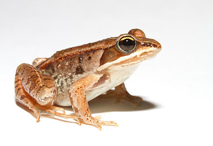

# Shuffling labels to generate a null {#perm1}   

```{r, echo = FALSE, warning=FALSE, message=FALSE}
library(tidyverse)
library(DT)
library(knitr)
library(blogdown)
library(stringr)
library(tweetrmd)
library(emo)
library(tufte)
library(cowplot)
library(lubridate)
library(ggthemes)
library(kableExtra)
library(ggforce)
library(datasauRus)
library(ggridges)
library(randomNames)
library(infer)
library(tiktokrmd)
library(ggridges)
library(colorspace)
options(crayon.enabled = FALSE)   
```


```{block2, type='rmdnote'}
The closest thing to these note is section 8 in chapter 13 of  our textbook.   **The reading below is required,**  @whitlock2020 is  not.    
```


<span style="color: Blue;font-size:22px;">   Motivating scenarios:  </span>  <span style="color: Black;font-size:18px;">   You want to make the ideas of a null sampling distribution and a p-value more concrete  and learn a very robust way to test null hypotheses while you're at it. </span> 

**Learning goals: By the end of this chapter you should be able to**    

- Explain what a permutation is.    
- Explain why permuting many times generates a sampling distribution under the null.   
- Use `R` to permute data to see if two sample means come from the different (statistical) populations.   
- Identify that we use permutation (shuffling) to generate null distributions, and bootstrapping (resampling with replacement) to estimate uncertainty.  
- Generalize the idea of permutation as a way to test most null models.    


```{block2, type='rmdwarning'}
In addition to this reading and the quiz, please read [Some Natural Solutions to the p-Value Communication Problem—and Why They Won’t Work](http://www.stat.columbia.edu/~gelman/research/published/jasa_signif_2.pdf).  

But [this paper](https://peerj.com/articles/9089/) by my colleague here [@fieberg2020] helps lay out why this is a good way to do and teach statistics.   
```


## One simple trick to generate a null distribution


```{r, echo=FALSE}
tweet_embed("https://twitter.com/kdc509/status/1353808281563619333")
```


In Chapter \@ref(hypoth), we discussed the idea behind null hypothesis significance testing.  Specifically, **the challenge in null hypothesis significance testing is to figure out how often we would see what we saw if some boring *null hypothesis* was true**.  A key step in this process is comparing our observed "*test statistic*" to its sampling distribution when the null hypothesis is true. 

<span style="color: lightgrey;">Later in the course we will deal with special cases for which mathematicians have estimated a sampling distribution under some set of assumptions.  But </span> A really clean way to generate a null distribution is to shuffle your data randomly, as if nothing where happening. Unlike the math tricks we cover later, this shuffling approach, known as **permutation**, makes very few  assumptions. The most critical assumption of the permutation test is that samples are random, independent, and collected without bias, and that the null is no association.  


```{r, fig.cap="Listen to the permutation anthem [here](https://www.youtube.com/watch?v=KQ6zr6kCPj8).", echo=FALSE}
include_graphics("https://i.imgur.com/TD6Hc06.gif")
```

### Motivation:  

One of the most common statistical hypotheses we ask are "Do these two samples differ." For example,   

- Do people who get a vaccine have worse side effects than people getting a placebo?   
- Does planting a native garden attract pollinators?   

So how do we go about asking these questions from data?  

In this chapter we focus in permuting to test for differences between two groups, but *permutation is super flexible and can be used for most problems, where the null is "no association"!*


## Case study: Mate choice & fitness in frogs  

There are plenty of reasons to choose your partner carefully. In much of the biological world  a key reason is "evolutionary fitness" -- presumably organisms evolve to choose mates that will help them make more (or healthier) children. This could, for example explain Kermit's resistance in one of the [more complex love stories of our time](https://www.insider.com/miss-piggy-and-kermit-relationship-timeline-2018-12), as frogs and pigs are unlikely to make healthy children.   

To evaluate this this idea @swierk2019, identified a males top choice out of two female wood frogs and then had them mate with the preferred or unpreferred female and counted the number of hatched eggs. 


```{r, echo=FALSE,out.extra= 'allowfullscreen', out.width="30%", out.extra='style="float:right; padding:10px"'}

```

**Concept check**   

- Is this an experimental or observational study?       
- Are there any opportunities for bias? Explain!   
- What is the biological hypothesis?   
- What is the statistical null?   

Here are the raw data   (download [here](https://raw.githubusercontent.com/ybrandvain/biostat/master/data/Swierk_Langkilde_BEHECO_1.csv) if you like)

```{r, echo=FALSE}
frogs <- tibble(read.csv("data/Swierk_Langkilde_BEHECO_1.csv")) %>%
  dplyr::select(year, pond, treatment,hatched.eggs, total.eggs, num.metamorphosed,field.survival.num)

DT::datatable(frogs,
              options = list(autoWidth = TRUE,pageLength = 5, lengthMenu = c(5, 25, 50)
))
```

## What to do with data?

So we have this data set that informs a biological quetsion! What do we do, now? 

### Visualize patterns  


One of the first things we do with a new data set is visualize it!  
A quick exploratory plot (Chapters \@ref(viz1), \@ref(goodfigs)), helps us understand the shape of our data, and devise an appropriate analysis plan!   


```{r, warning=FALSE, fig.width=3.5, fig.height=2.5, warning=FALSE, message=FALSE}
library(ggforce)
ggplot(frogs, aes(x = treatment, y =  hatched.eggs, color = treatment, shape = treatment  ))+
  geom_sina(show.legend = FALSE)+ # if you don't have ggforce you can use geom_jitter
  stat_summary(color = "black",show.legend = FALSE)
```      

### Estimate parameters {#est}

Now that we understand the shape of our data we can devise meaningful summaries by estimating appropriate parameters (Chapter \@ref(summaRy)).   

For the frog mating let's first quantify the mean and standard deviation in the number of hatched eggs in the preferred and non-preferred mating groups.

```{r, message=FALSE, warning=FALSE}
frog_summary <- frogs                           %>%
  group_by(treatment)                           %>%
  summarise(mean_hatched = mean(hatched.eggs),
              sd_hatched =   sd(hatched.eggs))

frog_summary 
```

One high-level summary here could be the difference in mean eggs hatched in preferred vs.  nonpreferred matings      

```{r}
mean_diff <- summarise(frog_summary,  nonpref_minus_pref = diff(mean_hatched))

pull(mean_diff) %>% round(digits = 2) 
```


... So visual and numeric summaries suggest that contrary to our expectation, we get more eggs from pairs of frogs when males don't get their preferred mate. But, we know that sample estimates will differ from population parameters by chance (aka. sampling error).  So we ...

### Quantify uncertainty  


So the estimated means are not identical, but we also know that there is substantial variability within each group <span style="color: lightgrey;">  (standard deviations of `r filter(frog_summary , treatment ==  "preferred") %>%pull(sd_hatched) %>% round(digits= 0)` and `r filter(frog_summary , treatment ==  "nonpreferred") %>%pull(sd_hatched) %>% round(digits= 0)` for preferred and nonpreferred matings, respectively).</span>  

**So we quantify uncertainty** with the  'bootstrap' described in Chapter \@ref(uncertainty). Specifically, we resample within each treatment with replacement, and     

- Calculate groups means in this resampled data set,  and     
- Calculate the distribution of differences in the mean for each permutation.     

```{r, message=FALSE, warning=FALSE}
n_reps <- 1000

# We bootstrap just as we did previously,
# (wrapping slice_sample inside replicate),
# but we want to return the difference in
# means as our summary, so we make the data
# wide and mutate to assign the difference 
# in mean to 

frogs.boot <- replicate(n = n_reps , simplify = FALSE,
  expr  = frogs %>%
    group_by(treatment) %>%
    slice_sample(prop = 1, replace = TRUE) %>%
    group_by(treatment) %>%
    summarise(mean_hatched = mean(hatched.eggs)) %>%
    pivot_wider(names_from = treatment, values_from = mean_hatched) %>%
    mutate(nonpref_minus_pref = nonpreferred -  preferred)) %>%
  bind_rows()
```

Here are the bootstrap results: 

```{r, echo=FALSE}
frogs.boot %>% 
  mutate_all(round,digits = 2) %>%
DT::datatable(.,
              options = list(autoWidth = TRUE,pageLength = 5, lengthMenu = c(5, 25, 50)
))
```

Let's summarize uncertainty. To do so, we     

- Find the standard error as the standard deviation of the bootstrapped distribution.     
- Find the upper and lower (95%) Confidence Intervals as the extreme 2.5 percentiles of the bootstrapped distribution.  

```{r, message=FALSE, warning=FALSE}
frogs.uncertainty <- frogs.boot %>% 
  pivot_longer(cols = 1:3, names_to = "type",
               values_to = "hatched") %>%
  group_by(type) %>%
  summarise(se = sd(hatched),
            lower_95_ci = quantile(hatched, prob = 0.025),
            upper_95_ci = quantile(hatched, prob = 0.975))
```

```{r, echo=FALSE}
frogs.uncertainty %>%
  kbl(digits = 2) %>%
  kable_styling()
```

```{r, echo=FALSE, fig.height=2.4, fig.width=4.4, message=FALSE, warning=FALSE}
ggplot(frogs.boot, aes(x = nonpref_minus_pref))+ 
  geom_histogram(color = "white")+
  geom_vline(xintercept = frogs.uncertainty %>%
               filter(type == "nonpref_minus_pref") %>% 
               pull(lower_95_ci) , 
             color = "blue", lty = 2)+
  geom_vline(xintercept = frogs.uncertainty %>%
               filter(type == "nonpref_minus_pref") %>% 
               pull(upper_95_ci) , color = "blue", lty = 2)+
  annotate(geom = "label",x = -70, y = 90, label = "95% CI",color = "blue")+
  labs(title = "Bootstrap distribution",
       x = "# eggs w. nonpreferred mate - # eggs w. preferred mate")
```

<span style="color: red;">**There is considerable uncertainty in our estimates**</span> -- our bootstrapped 95% confidence interval includes some cases in which preferred matings yield more hatched eggs than nonpreferred matings, in addition to cases in which nonpreferred matings yield more hatched eggs.  

How do we test the null model that mate preference does not matter to egg hatching? Let's generate a sampling distribution under the null!  


## Permute to generate a null distribution!  


<span style="color: Black;font-size:46px;">**IT'S TIME TO...**</span>

```{r, echo=FALSE}
include_graphics("https://media.giphy.com/media/pRHkn0CC08Wn6/giphy.gif")
```      

<span style="color: Black;font-size:46px;">**PERMUTE THE FROG**</span>

In a permutation test, we generate a null distribution by shuffling the association between explanatory and response variables. We then calculate a P-value by comparing the test statistic of the actual data to this null distribution we found by shuffling.  


**Steps in a Permutation Test**    


1. State the null ($H_0$) and alternative ($H_A$) hypotheses.   
2. Decide on a test statistic.   
3. Calculate the  test statistic for the actual data.     
4. Permute the data by shuffling values of explanatory variables across observations.     
5. Calculate the test statistic on this permuted data set.   
6. Repeat step 3 and 4 many times to generate the sampling distribution under the null (a thousand is standard... the more permutations, the more precise the p-value).   
7. Calculate a p-value as the proportion of permuted values that are as or more extreme than observed in the actual data.       
8. Interpret the p-value.         
9. Write up results. 

### Permutation: State $H_0$ and $H_A$    

- $H_0$: The number of hatched eggs does not differ in preferred vs. non-preferred matings.   
- $H_A$: The number of hatched eggs differs in preferred vs. non-preferred matings.          


### Permutation: Decide on a test statistic.   

The test statistic for a permutation can be whatever we think best captures our biological hypothesis.  For this case, let's say the test statistic is the difference in mean number of eggs hatched in nonpreferred and preferred matings.  


### Permutation: Calculate the  test statistic for the actual data.   

In section \@ref(est)  we  found   the mean number of eggs hatched     

-   Was `r round(pull(frog_summary[2,2]) , digits = 2)` in preferred matings,     
- And  `r round(pull(frog_summary[1,2]) , digits = 2)` in nonpreferred matings.    

Yielding a difference of `r pull(mean_diff) %>% round(digits = 2)` between the means.   


### Permutation: Permute the data.    

So now we permute the data by randomly shuffling "treatment" onto our observed response variable, `hatched.eggs`, by using the [`sample()`](https://stat.ethz.ch/R-manual/R-patched/library/base/html/sample.html) function. Let's make one permutation below.

```{r}
one.perm <- dplyr::select(frogs,treatment, hatched.eggs)     %>%
  mutate(perm_treatment = sample(treatment, size = n(), replace = FALSE))         
```

```{r, echo = FALSE}
one.perm  %>%
  mutate(diff_label     = treatment !=perm_treatment) %>%
  relocate(hatched.eggs, .after = diff_label)%>%
DT::datatable(.,options = list(autoWidth = TRUE,pageLength = 5, lengthMenu = c(5, 25, 50)))
```

So we see that after randomly shuffling treatment onto values, some observations stay with the original treatment and some swap. This generates a null as if there is no association because we randomly shuffled, removing a biological explanation for an association.  

### Permutation: Calculate the test statistic on permuted data.   

Let's take the difference in means in this permuted data set.  As in section \@ref(est), to do so we  

- `group_by()` (permuted) treatment   
- `summarise()` (permuted) treatment means   
- find the `diff()`erence between group means   

```{r, message=FALSE, warning=FALSE}
perm.diff <- one.perm %>%
  group_by(perm_treatment) %>%
  summarise(mean_hatched = mean(hatched.eggs))%>%
  summarise(diff_hatched = diff(mean_hatched))
```

```{r, echo=FALSE}
perm.diff 
```

So we see that our single permutation (i.e. one sample from the null distribution) revealed a difference of `r round(pull(perm.diff ), digits = 2)` eggs on average between the non-preferred and preferred matings. REMEMBER we know there is no actual association in the permutation because we randomly shuffled. We now do this many times to find the sampling distribution under the null.  

This permuted difference of `r round(pull(perm.diff), digits = 2)` is  **`r ifelse(abs(pull(perm.diff ))  > abs(pull(mean_diff)) , "MORE","LESS")` extreme** than the actual difference of `r round(pull(mean_diff), digits = 2)` between treatments. 

### Permutation: Permute a bunch to build the null sampling distribution


But, this is just one sample from the null distribution.  Now we do this many times to generate the sampling distribution.     

#### **PERMUTE MANY TIMES** AND **SUMMARIZE PERMUTED GROUPS FOR EACH REPLICATE**  {-}   {-}  

```{r}
perm_reps   <- 1000

many.perms <- replicate(n = perm_reps, simplify = FALSE,
 expr  = frogs %>% 
   dplyr::select(treatment, hatched.eggs)     %>%
   dplyr::mutate(perm_treatment = sample(treatment, size = n(), replace = FALSE)) %>%
    group_by(perm_treatment) %>%
    summarise(mean_hatched = mean(hatched.eggs)) %>%
    pivot_wider(names_from = perm_treatment, values_from = mean_hatched) %>%
    mutate(diff_hatched = nonpreferred -  preferred)) %>%
  bind_rows()

many.perms

ggplot(many.perms, aes(x = diff_hatched)) +
  geom_histogram(bins = 32, color = "white")+
  labs(title = "Permuted sampling distribution")+
  geom_vline(xintercept = pull(mean_diff), color = "red", lty = 2)+
  annotate( x = pull(mean_diff), y = 70, hjust = 1, geom = "label", label = "observed", color = "red", alpha = .4)
```


### Permutation:  Calculate a p-value. 


Now that we have our observed test statistic and its sampling distribution under the null, we can calculate a p-value -- the probability that we would observe a test statistic as or more extreme than what we actually saw if the null were true.

We do this by finding the proportion of permuted replicates that are as or more extreme than the actual data. **To look at both tails (i.e. a two-tailed test) we work with absolute values - allowing us to work with one tail while incorporating both extremes**.


```{r permdist, fig.cap= "Sampling distribution for the difference in mean eggs hatched by treatment under the null hypothesis (light blue lines show the observed value).", fig.height=3, fig.width=4}
many.perm.diffs <- many.perms %>% 
  dplyr::select(diff_hatched) %>%
  mutate(abs_obs_dif = abs(pull(mean_diff)),
         abs_perm_dif = abs(diff_hatched),
         as_or_more_extreme = abs_perm_dif >= abs_obs_dif)

# Plot the permuted distribution
ggplot(many.perm.diffs, aes(x = diff_hatched, fill = as_or_more_extreme )) +
  geom_histogram(bins = 35, color = "white")    +  
  scale_fill_manual(values = c("grey","black")) +
  theme_light()                                 +
  theme(legend.position = "bottom")             + 
  labs(title = "Permuted distribution")         +
  geom_vline(xintercept = c(-1,1)*pull(mean_diff), color = "lightblue") +
  annotate(x = pull(mean_diff), y = 79, geom = "label", color = "lightblue", label = "Observed", alpha = .4)+
  scale_y_continuous(limits = c(0,100))
```


#### **CALCULATE A P-VALUE** {-}

Find the proportion of permutations that are as or more extreme than the real data (i.e. the proportion of the histogram in Figure \@ref(fig:permdist)) by taking the mean of `as_or_more_extreme` (`FALSE = 0, TRUE = 1`). 

```{r, echo=FALSE, message=FALSE, warning=FALSE}
summarise(many.perm.diffs, p_value = mean(as_or_more_extreme))
```


### Permutation:  Interpret the p-value. 

```{r, echo=FALSE, message=FALSE, warning=FALSE}
thisp <- summarise(many.perm.diffs, p_value = mean(as.numeric(as_or_more_extreme)))%>% 
  pull() 
```

So, we found a p-value of `r thisp`, meaning that in a world with no true association between mating treatment and eggs hatched, `r thisp*100`% of samples would be as or more extreme than what we observed in our actual sample. 

As such we **fail to reject the null hypothesis** as we don't have enough evidence to support the alternative hypothesis that number of eggs hatched differs based on mating with preferred or nonpreferred frogs.  

## Example write up.  

So let's take this opportunity to practice writing up a scientific result.  


> To test the idea that mating with preferred partners increased reproductive output, we analyzed data from wood frogs (*Rana sylvatica*). In this experiment, @swierk2019, identified frogs' preferred partners,  randomly assigned some frogs preferred and other non-preferred partners, and counted the number of hatched eggs in each group. These data, presented in Figure \@ref(fig:frogexplan), show that slightly fewer eggs hatched from preferred (mean = `r filter(frog_summary, treatment == "preferred") %>% pull(mean_hatched) %>% round() %>% as.numeric()`, HERE bootstrapped 95% CI = {`r filter(frogs.uncertainty, type == "preferred") %>% pull(lower_95_ci) %>% as.numeric()%>% round()`, `r filter(frogs.uncertainty, type == "preferred") %>% pull(upper_95_ci) %>% as.numeric()%>% round()`}) than non nonpreferred couples (mean = `r filter(frog_summary, treatment == "nonpreferred") %>% pull(mean_hatched) %>% round() %>% as.numeric()`, bootstrapped 95% CI = {`r filter(frogs.uncertainty, type == "preferred") %>% pull(lower_95_ci) %>% as.numeric()%>% round()`, `r filter(frogs.uncertainty, type == "preferred") %>% pull(upper_95_ci) %>% as.numeric()%>% round()`}), but there was large variability within each couple ($sd_\text{preferred} = `r filter(frog_summary, treatment == "preferred") %>% pull(sd_hatched) %>% round() %>% as.numeric()`$, $sd_\text{nonpreferred} = `r filter(frog_summary, treatment == "nonpreferred") %>% pull(sd_hatched) %>% round() %>% as.numeric()`$). This small difference in means was not significant (two-tailed permutation-based p-value = 0.30) -- as such we cannot reject the null hypothesis and conclude that there is no evidence to suggest that preferred and nonpreferred woodfrog couples hatch different numbers of eggs.


```{r frogexplan, fig.cap='No evidence that the number of hatched eggs differed in nonpreferred vs preferred matings (two-tailed permutation based p-value = 0.30). Emojis show raw data, points show groups means, and lines display bootstrapped 95% confidence intervals.', fig.height=2.5, fig.width=4, echo = FALSE}

library(emojifont)
frogs %>%
  mutate(label = case_when(treatment == "preferred" ~ emoji("heart"),
                           treatment == "nonpreferred" ~ emoji("broken_heart"))) %>%
  ggplot(aes(x = treatment, y = hatched.eggs, label = label, color = treatment)) +
  geom_text(family="EmojiOne", size=4, vjust = .3, position = position_jitter(seed = 1, width = .3,height=0))+
  stat_summary(fun.data = 'mean_cl_boot') +
  scale_color_manual(values = c("black","red"))+ 
  theme(legend.position = "none")+
  labs(x = "Mating partner",  y = "# eggs hatched")  
```

## How to deal with nonindependence by permutation   

Permutation can solve so many stats problems. But if data are complex (e.g. more than one explanatory variable), we need to think about how to shuffle data to test these hypotheses we're interested in, and not some confounding factor. 

For example, our frog experiment was actually conducted over two years, and the design was slightly unbalanced -- there were more non-preferred than preferred couples in 2013. So our p-value above is a bit wrong - as the difference in years could confound our answer. 

```{r,message=FALSE, warning=FALSE}
frogs %>% 
  group_by(year, treatment) %>% 
  summarise(n = n())
```

In fact, the mean number of hatched eggs differs substantially across years 


```{r,message=FALSE, warning=FALSE, fig.height=3, fig.width=7}
frogs %>% 
  ggplot(aes(x= factor(year), y = hatched.eggs, color = treatment)) +
  geom_jitter(height = 0, width = .1, size= 1, alpha = .3)          +
  stat_summary(position = position_nudge(x= c(.15,.2)))
```

So we have to deal with such non-independence to ensure that, we can shuffle treatments within a year as follows. Things can get even more complicated with more complex non-independence.  

We can `group_by()` whatever variables we want to shuffle within to preserve the structure of our data, 

```{r,message=FALSE, warning=FALSE}
year_perm <- replicate(n = 1000,simplify = FALSE,
    frogs %>% 
      group_by(year)                          %>%
      mutate(perm_treatment = sample(treatment))   %>%
      group_by(perm_treatment) %>%
      summarise(mean_hatched = mean(hatched.eggs)) %>%
      pivot_wider(names_from = perm_treatment, values_from = mean_hatched) %>%
      mutate(diff_hatched_perm = nonpreferred -  preferred)) %>%
  bind_rows()
```


OK so now let's calculate summary stats and find a p-value!!! Note that we don't have to worry about year anymore because we permuted within year!  

```{r,message=FALSE, warning=FALSE}
abs_observed_mean <- frog_summary %>% summarise(abs(diff(mean_hatched))) %>%pull()

year_perm %>% 
  summarise(abs_perm_diff_hatched  = abs(diff_hatched_perm)) %>%
  ungroup() %>%
  mutate(as_or_more_extreme = abs_perm_diff_hatched >= abs_observed_mean) %>%
  summarise(p_value = mean(as_or_more_extreme))
```


This more appropriate p-value still exceeds our traditional $\alpha$ threshold of 0.05, but is way closer to it, and so while we would still formally "fail to reject the null hypothesis", we might be somewhat more willing to entertain the idea that frogs lay more eggs with non-preferred mates from this correct p-value than from the one calculated without considering the effect of year.


## Permute quiz   

```{r, echo=FALSE}
include_app("https://brandvain.shinyapps.io/permute/",height = '800' )
```


## Code for figure


```{r eval = FALSE}

library(emojifont)
frogs %>%
  mutate(label = case_when(treatment == "preferred" ~ emoji("heart"),
                           treatment == "nonpreferred" ~ emoji("broken_heart"))) %>%
  ggplot(aes(x = treatment, y = hatched.eggs, label = label, color = treatment)) +
  geom_text(family="EmojiOne", size=4, vjust = .3, position = position_jitter(seed = 1, width = .3,height=0))+
  stat_summary(fun.data = 'mean_cl_boot') +
  scale_color_manual(values = c("black","red"))+ 
  theme(legend.position = "none")+
  labs(x = "Mating partner",  y = "# eggs hatched")  
```


```{r, echo=FALSE}
rm(list = ls())
```

