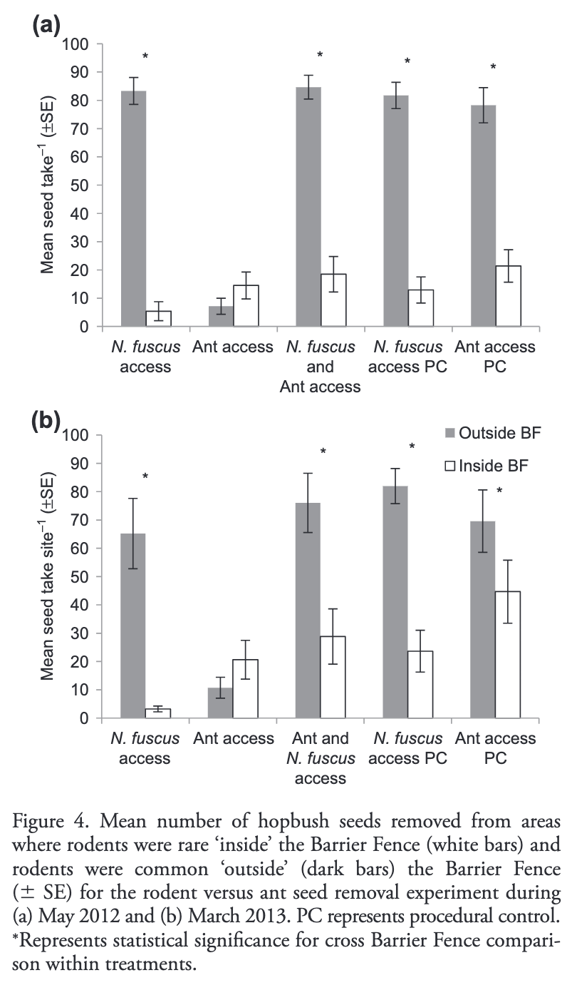
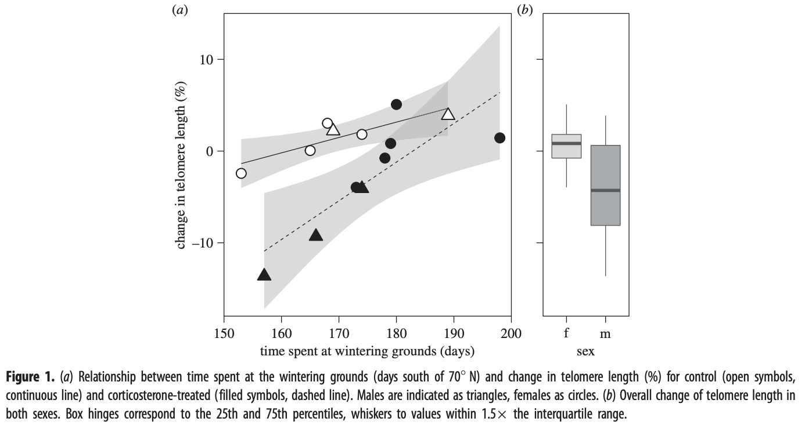
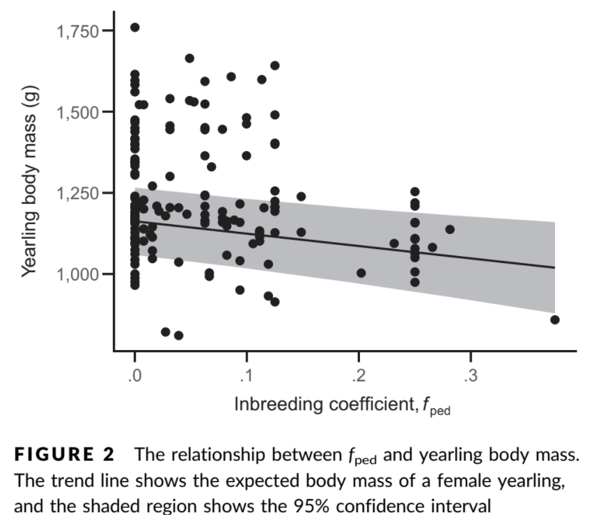

# Review + Fun data sets if you need them {#moredata}   

```{r, echo = FALSE, warning=FALSE, message=FALSE}
library(tidyverse)
library(gridExtra)
library(DT)
library(knitr)
library(blogdown)
library(stringr)
library(tweetrmd)
library(emo)
library(tufte)
library(cowplot)
library(lubridate)
library(ggthemes)
library(kableExtra)
library(ggforce)
library(datasauRus)
library(ggridges)
library(randomNames)
library(infer)
library(tiktokrmd)
library(ggridges)
library(colorspace)
library(ggfortify)
library(broom)
library(emojifont)
library(magrittr)
library(plotly)
options(crayon.enabled = FALSE)   
```


##  Review   

You should be pretty comfortable with the ideas of   

- Parameters vs Estimates    
- Sampling and what can go wrong   
- Null hypothesis significance testing   
- Common test statistics    
    - F   
    - t   
- Calculating Sums of Squares      
- Interpreting stats output like that below   

```{r, message=FALSE, warning=FALSE}
ToothGrowth <- mutate(ToothGrowth, dose = factor(dose))
tooth_lm <- lm(len ~ supp * dose, data = ToothGrowth)


summary(tooth_lm)   
anova(tooth_lm)
Anova(tooth_lm, type = "II")   
```


## Quiz  

Reflection questions on [canvas]
## Potential data sets 

Spend the weekend pushing forward on your linear model project.

Recall that a major assumption of linear models is that errors are normally distributed. 

Although linear models are robust to minor violations of these assumptions, they are not a good choice for a categorical response variable -- so if your early analyses had categorical response variables you probably need a  new data set. Here are some  currated options.

### Consequences  of extinction {-}


Functional extinction of a desert rodent: implications for seed fate and vegetation dynamics. @gordon2016 . [data for project](https://raw.githubusercontent.com/ybrandvain/biostat_2022/main/data/rodent_extinction.xlsx) (.xlsx format), [paper](https://onlinelibrary.wiley.com/doi/full/10.1111/ecog.01648), full data on [dryad](https://datadryad.org/stash/dataset/doi:10.5061/dryad.p45p4).

Image from paper [dont try to recreate this]

```{r, echo=FALSE}

```


### Moving and other stresses might shorten telomeres  {-}   


Migration and stress during reproduction govern telomere dynamics in a seabird. @schultner2014. [data for project](https://raw.githubusercontent.com/ybrandvain/biostat_2022/main/data/telomere.xlsx) (.xlsx format), [paper](https://royalsocietypublishing.org/doi/pdf/10.1098/rsbl.2013.0889).


```{r, echo=FALSE}

```


### Associations between neurons and IQ  {-}   


Large and fast human pyramidal neurons associate with intelligence. @goriounova2018. [data for project](https://raw.githubusercontent.com/ybrandvain/biostat_2022/main/data/neuronsAndIntel.xlsx) (.xlsx format), [paper](https://elifesciences.org/articles/41714), [dryad](https://datadryad.org/stash/dataset/doi:10.5061/dryad.83dv5j7).

### Inbreeding and fitness  {-}   


A high-quality pedigree and genetic markers both reveal inbreeding depression for quality but not survival in a cooperative mammal. @wells2018. data for project [annual reproduction](https://raw.githubusercontent.com/ybrandvain/biostat_2022/main/data/annual_reproduction_data.csv) (.csv format), [yearling weight](https://raw.githubusercontent.com/ybrandvain/biostat_2022/main/data/yearling_weight_data.csv) (.csv format).   [paper](https://drive.google.com/file/d/1LfKMsqC3I22Hedwk_1J4OfrrcQTvW8xB/view?usp=sharing), [dryad](https://datadryad.org/stash/dataset/doi:10.5061/dryad.bq868sh).


# Potential Datasets For Projects  {-}

```{r, echo = FALSE, warning=FALSE, message=FALSE}
library(tidyverse)
library(knitr)
library(blogdown)
library(stringr)
library(tweetrmd)
```

We want practice with real-world data sets that are the appropriate to build our skills. I strongly believe the best data sets are one you care about / are invested in. But not all of you have those. Here are some data sets for you if you don't have any data sets that you're invested in.  

## Previous examples that should work


## Salmon size   {-}   

After approximately three years as babies salmon become mature and are ready for the ocean. Hendry et al, measured the mass and length of female salmon who have been in the ocean for two or three years. The data are here. [data](https://whitlockschluter3e.zoology.ubc.ca/Data/chapter02/chap02f2_5SalmonBodySize.csv), [paper](http://redpath-staff.mcgill.ca/hendry/Hendry1999Oikos.pdf).   

## Chip off the old block    {-}   

There are many hypotheses for the evolution of sexual selection. One such hypothesis is the sexy son theory - a somewhat circular (but not illegitimate) argument that females gain an evolutionary advantage by mating with attractive males because those males will give rise to attractive sons that will have success with other females. This theory requires a association between dad and son sexual attractiveness. Brooks measured the attractiveness of father-son pairs of male guppies (by evaluating female's preference for them). [data](https://whitlockschluter3e.zoology.ubc.ca/Data/chapter02/chap02f3_3GuppyFatherSonAttractiveness.csv), [paper](https://www.nature.com/articles/35017552).  

## Life at high altitude {-}     

Living at high altitude represents some physiological challenges of living with a  limited oxygen supply. Human populations in the Andes, Ethiopia, and Tibet have faced these challenges, and adapted. One potential mechanism of this adaptation is to raise the hemoglobin content of blood to get more oxygen. Beall et al measured the hemoglobin content of people from these three populations as well as a control of males living at sea level in America.  [data](https://whitlockschluter3e.zoology.ubc.ca/Data/chapter02/chap02e3bHumanHemoglobinElevation.csv), [paper](https://www.pnas.org/content/99/26/17215).   


```{r lifehigh2, fig.cap='A mountain in Tibet from the [New York Times](https://www.nytimes.com/2011/03/06/books/review/Becker-t.html)', echo=FALSE}
include_graphics("https://static01.nyt.com/images/2011/03/06/books/review/SUBB-Becker/SUBB-Becker-jumbo.jpg")
```


##  Eat leas, live longer?  {-}     

For some reason, restricting food intake often increases lifespan.To see if this was the case, Mattison et al fed 17  rhesus monkeys (7 females, 10 males) a reduced diet with 30% of the normal nutrition, and 17 other rhesus monkeys (8 females, 9 males) a normal nutritious diet. [data](https://whitlockschluter3e.zoology.ubc.ca/Data/chapter02/chap02q35FoodReductionLifespan.csv), [paper](https://pubmed.ncbi.nlm.nih.gov/22932268/).  

## Fruit and photosynthesis  {-}   

To investigate if previous reproductive efforts impact subsequent growth and photosynthesis, Wheelright and Logan looked at the previous number of fruits and the photosynthetic activity of nine female *Ocotea tenera* trees - a neotropical species. [data](https://whitlockschluter3e.zoology.ubc.ca/Data/chapter02/chap02q26NeotropicalTreePhotosynthesis.csv), [paper](https://www.pnas.org/content/101/21/8051). 


```{r Ocoteapics2, fig.cap='Image of  *Ocotea tenera* from wikimedia commons', out.width='30%', echo=FALSE}
include_graphics("https://upload.wikimedia.org/wikipedia/commons/6/6b/Ocotea_tenera_%289755231383%29.jpg")
```


## A gene for monogamy? {-}   

The gene for the vasopressin receptor *V1a* is expressed at higher levels in the forebrain of monogamous than promiscuous vole species. To see if expression of this gene influenced monogamy, Lim et al experimentally enhanced *V1a* expression in the forebrain of 11 males of the meadow vole - a solitary promiscuous species, and compared the percentage of time these and control males spent huddling with a female placed with him (as a measure of monogamy). [data](https://whitlockschluter3e.zoology.ubc.ca/Data/chapter03/chap03q15VasopressinVoles.csv), [paper](https://www.nature.com/articles/nature02539).   


```{r volepics2, fig.cap='Image of cuddling voles from  [Newsweek](https://www.newsweek.com/fall-love-brain-circuits-involved-prairie-voles-618111)', out.width='40%', echo=FALSE}
include_graphics("https://d.newsweek.com/en/full/618098/male-female-vole.webp?w=737&f=1f928e86b16eb80f2e450ba7f13232cf")
```
 
 
 
## Running with a lighter load {-}   

Male spiders in the genus *Tidarren* are tiny and weigh about 1 percent as much as females. Just before sexual maturity, males voluntarily amputate one of their two organs just before sexual maturity. Could this maybe allow them to move faster? [data](https://whitlockschluter3e.zoology.ubc.ca/Data/chapter03/chap03e2SpiderAmputation.csv), [paper](https://www.pnas.org/content/101/14/4883).     

```{r Tidarren2, fig.cap='Image of Tidarren from  [Ramos et al.](https://www.pnas.org/content/101/14/4883) Their legend *A male T. sisyphoides before (A) and after (B) removing a pedipalp. Note the pedipalps overlap in the two-pedipalp condition (A), whereas the one pedipalp is carried in a central position after pedipalp removal (B). (The scale bars represent 1 mm.)*', out.width='40%', echo=FALSE}
include_graphics("https://www.ncbi.nlm.nih.gov/pmc/articles/PMC387343/bin/zpq0090440220001.jpg")
```
 

##  Protected fish {-}    


The marine threespine stickleback is a small coastal fish named for its defensive armor. It has three shrp spines on its back, two pelvic spines under its belly and a series of lateral bony plates down its side.The armor seems to reduce mortality from predatory fish and diving birds. In lakes and stream (as compared to the ocean) there are fewer predators, and fish have reduced armor. Researchers hypothesized this difference may mediated by a gene called ectodysin.  They crossed marine (*M*) and freshwater (*m*) fish to make F1 *Mm* heterozygotes and crossed these to one another two make individuals who have 0 (*mm*), 1 (*Mm*), or 2 (*MM*) copies of the marine allele at the ectodysin locus. [data](https://whitlockschluter3e.zoology.ubc.ca/Data/chapter03/chap03e3SticklebackPlates.csv),  [paper](https://journals.plos.org/plosbiology/article?id=10.1371/journal.pbio.0020109).

```{r stickleback2, fig.cap='Image of benthic and marine sticklebacks (from [oceanbites](https://oceanbites.org/little-fish-new-pond-watching-stickleback-evolution-in-real-time/)', out.width='50%', echo=FALSE}
include_graphics("https://oceanbites.org/wp-content/uploads/2016/01/2.2-4.jpg")
```


```{r, echo=FALSE}

```


